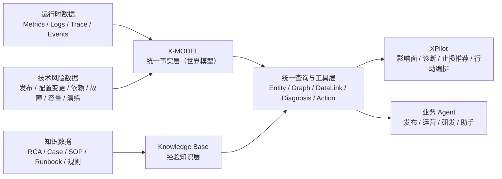
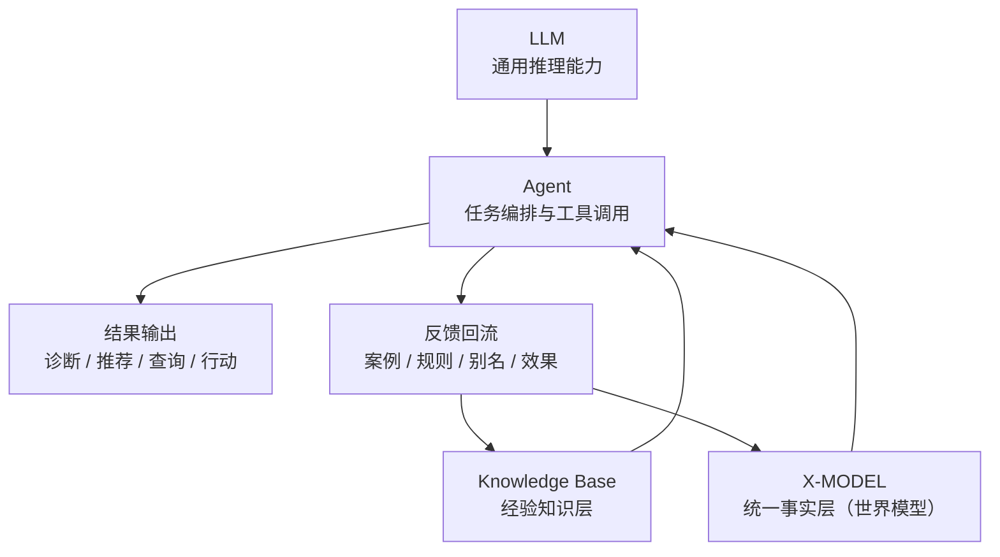
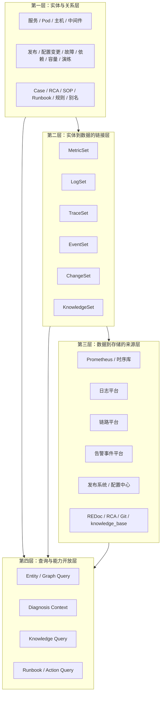
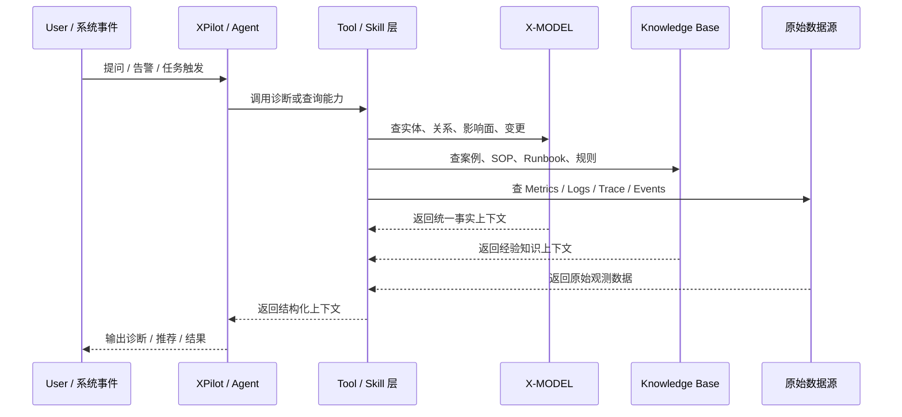

# X-MODEL 数据与知识底座方案

## 0. 核心速览

### 0.1 我们到底要做什么

我们要建设的不是单独的知识库，也不是单独的 Agent，而是一套面向 XPilot 和业务 Agent 的基础能力：

- 一层统一事实层，描述技术风险世界当前发生了什么
- 一层经验知识层，沉淀历史案例、规则、SOP 和 Runbook
- 一层 Agent 消费层，把事实和知识转成可用能力

一句话：

**建设一套“数据与知识底座”，为 Agent 提供统一上下文底座（世界模型）。**

### 0.2 它解决什么问题

这套底座的目标不是让 AI 更会说，而是让 Agent 更稳定、更快速、更可信地输出结果。

它重点解决 5 个问题：

- 让 Agent 更稳定地理解当前真实上下文，而不是临时猜
- 让 Agent 更快拿到关系、影响面、变更、案例和诊断线索
- 让 Agent 把运行时事实和历史经验结合起来，而不是只看文档或只看链路
- 让能力可以开放给多个 Agent 复用，而不是每个 Agent 都自己拼一套
- 让高风险动作有统一边界、统一入口和统一审计

### 0.3 这件事的直接收益

对 XPilot：

- 更快拿到诊断上下文
- 更稳定做影响面分析
- 更可靠生成止损推荐
- 更容易从问答走向诊断和行动

对业务 Agent：

- 能调用统一的技术查询和风险分析能力
- 不用自己理解底层监控、链路、知识库的细节
- 能在发布、运营、研发等场景复用技术能力

对平台：

- 把零散的数据、知识、规则和工具沉淀成统一能力
- 从单点 Agent 应用，升级为平台级技术底座

### 0.4 如果只记住 4 句话

1. `LLM` 很聪明，但不知道你们这次故障的真实上下文。
2. `Trace / Logs / RAG` 都很重要，但都只是原材料，不是统一上下文底座本身。
3. `X-MODEL` 负责统一事实，`Knowledge Base` 负责沉淀经验。
4. 这套底座既服务 `XPilot`，也应该开放给更多业务 Agent 使用。

### 0.5 一张总图

## 1. 先说结论

我们要建设的，不是一个单独的知识库，也不是一个单独的技术风险 Agent，而是一套面向 Agent 的基础能力：

- 用统一事实层描述当前技术风险世界里发生了什么
- 用知识层沉淀历史案例、经验、预案和规则
- 对上支撑 XPilot 做影响面分析、诊断、止损推荐、关联查询和安全行动编排
- 对外开放给业务 Agent 使用，成为基础技术能力

一句话概括：

**我们要建设的是一套“数据与知识底座”，也就是 Agent 的统一上下文底座（世界模型）。**

这里刻意不用“世界模型”做主称呼，是因为这个词在大模型语境里容易和 LLM 自身的内部表征混淆。  
在这份文档里，我们说的“世界模型”，更准确地说，是一套**外部化、可查询、可校验、可审计的统一上下文底座**。

## 2. 这套底座到底是什么

它不是一个库，也不是一个图数据库，更不是一句 prompt。

它本质上由三部分组成：

### 2.1 X-MODEL：统一事实层

X-MODEL 负责描述“现在这个技术风险世界是什么样”。

它关注的是事实：

- 当前有哪些服务、组件、资源、变更、事件、故障对象
- 它们之间是什么关系
- 某个故障正在影响哪些上下游
- 某个服务最近有哪些变更、告警、异常
- 某个实体对应应该去哪里查指标、日志、Trace、事件

可以把 X-MODEL 理解成：

**技术风险领域的统一事实层（世界模型）。**

### 2.2 Knowledge Base：经验知识层

Knowledge Base 负责描述“过去遇到过什么、通常怎么处理、哪些经验值得复用”。

它关注的是经验：

- 故障案例
- RCA
- SOP
- Runbook
- 根因模式
- 止损动作
- 风险提示
- 术语别名与规则

### 2.3 Agent Layer：能力消费层

Agent Layer 负责消费前两层能力。

对 XPilot 来说，它会利用统一事实层和经验知识层，完成：

- 影响面分析
- 故障诊断
- 止损推荐
- 关联查询
- 安全行动编排

对业务 Agent 来说，它可以利用这套底座完成：

- 技术状态查询
- 风险说明
- 依赖关系查询
- 发布风险提示
- 技术事件上下文补充

所以三者的关系不是并列项目，而是：

- `X-MODEL` 提供事实
- `Knowledge Base` 提供经验
- `Agent` 提供推理、编排和交互

### 2.4 一张关系图

## 3. 为什么现在要建设这套底座

过去做可观测，核心是“人能不能看到数据”；  
今天进入 AI Native 阶段，核心问题变成了“Agent 能不能稳定理解事实、利用知识、完成行动”。

我们现在已经有不少基础能力了：

- 可观测数据
- 链路数据
- 告警和事件
- 发布和配置变更
- RCA、案例库、SOP
- LLM 和 Agent 编排能力

但这些能力仍然是分散的，导致几个现实问题：

- 数据在不同系统里，缺少统一语义
- 实体关系主要靠人脑理解，Agent 难以稳定回答“影响谁”“先查什么”“最近变更是什么”
- 历史经验分散在文档里，虽然能搜到，但很难稳定复用
- LLM 很聪明，但不知道你们现在、此刻、这次故障的真实上下文
- 业务 Agent 即便想复用技术能力，也缺少统一入口

因此，问题不是“我们有没有数据和知识”，而是：

**我们缺少一层把数据、关系、知识、动作边界统一组织起来的上下文底座。**

## 4. 为什么 LLM 已经很强了，我们还需要这套底座

这是最容易被问到的问题。

LLM 确实知道很多概念。它知道什么是服务、发布、告警、回滚、依赖、容量，也能生成一套看起来合理的故障分析思路。

但它默认知道的是“通用世界”，不是“你们此刻的技术风险世界”。

它通常不知道这些关键信息：

- 你们内部真实有哪些服务、组件、系统、故障对象
- 同一个组件在不同系统里有哪些别名
- 当前真实的依赖关系、部署关系、上下游关系是什么
- 最近一次发布、配置变更、异常事件和当前故障是否相关
- 某个服务应该去哪个数据源看什么
- 哪个 Runbook 是安全的，哪个动作必须审批

所以问题不是“LLM 懂不懂概念”，而是：

**LLM 不天然掌握你们组织专属、实时变化、可执行落地的事实和规则。**

更准确地说：

- `LLM` 提供智能
- `统一上下文底座` 提供确定性

没有统一上下文底座，LLM 也能回答，但容易出现以下问题：

- 依赖这次 prompt 有没有带够上下文
- 依赖这次 RAG 有没有召回到正确文档
- 依赖概念有没有歧义
- 依赖它根据“常见经验”做的猜测，而不是基于当前真实状态

这就会导致一种典型现象：

**不是完全不会，而是时灵时不灵。**

对聊天和问答来说，这有时可以接受；  
对技术风险 Agent 来说，这不够。

可以把这件事再压缩成一句话：

- `LLM` 让系统有智力
- `统一上下文底座` 让系统有地图、记忆和边界

## 5. 为什么不能只靠链路数据、日志和现查数据来做

这也是一个非常关键的问题。

从故障定位角度看，链路数据当然很重要。  
很多时候，基于 Trace 的确能找到上下游，帮助判断问题大概在哪一层。

但“能基于链路定位一些问题”不等于“已经拥有 Agent 可用的统一事实层”。

如果只靠原始链路和现查数据，会有几个问题：

### 5.1 链路只覆盖了部分世界

Trace 最擅长描述的是“某次请求经过了谁”。  
但技术风险世界不只有调用链，还包括：

- 发布
- 配置变更
- 容量
- 风险依赖
- 故障单
- 演练
- Runbook
- 历史案例

这些对象不天然在 Trace 里。

### 5.2 链路是请求级证据，不是稳定实体认知

一次 Trace 表示的是“这次调用发生了什么”；  
Agent 需要的是更稳定的实体级认知：

- A 服务通常依赖哪些服务
- A 服务跑在哪些节点或 Pod 上
- A 服务最近被谁发布过
- A 服务关联哪些中间件、预案和历史案例

这需要把请求级证据提升为实体级关系。

### 5.3 原始链路不总是完整

Trace 会受采样、埋点覆盖、异步链路、消息队列、故障中断等因素影响。  
如果每次都依赖原始链路现算，稳定性会受影响。

### 5.4 每次现查成本高，复用性差

如果每个 Agent 每次都从海量 Trace、日志、事件里临时拼关系、拼上下文：

- 成本高
- 时延高
- 结果不稳定
- 难以开放给多个 Agent 复用

### 5.5 无法天然和知识层对齐

链路能告诉你“谁调用了谁”，  
但不会直接告诉你：

- 历史上这个问题怎么处理
- 哪个 Runbook 对这个服务有效
- 当前这个告警和哪类故障案例相似

所以更准确的表述是：

**Trace、日志、指标不是 X-MODEL 的替代品，而是 X-MODEL 的重要原材料。**

建设 X-MODEL，不是为了替代这些数据源，而是为了把这些原材料前置加工成 Agent 可稳定消费的统一事实层。

## 6. 为什么也不能只靠 RAG 和知识库

RAG 在知识召回方面很有价值，但它更适合解决“找资料”“找案例”“找文档”的问题。

如果只做 RAG，会有几个天然边界：

- 文档擅长表达说明，不擅长表达强关系
- 文档擅长记录历史，不擅长表达当前实时状态
- 文档之间关系往往是隐式的，不适合稳定做多跳推理
- 即使向量召回命中了，也不代表拿到的是这次故障最相关、最可执行的上下文

所以：

- `Knowledge Base + RAG` 很适合做经验知识层
- `X-MODEL` 更适合做统一事实层

两者不是替代关系，而是互补关系。

## 7. Agent、LLM、统一上下文底座三者分别是什么

为了避免概念打架，这里把三者定位讲清楚。

### 7.1 LLM 是通用推理器

LLM 擅长：

- 语言理解
- 总结归纳
- 规划下一步
- 生成解释
- 把结构化结果转成人能读懂的答案

### 7.2 Agent 是任务执行器

Agent 擅长：

- 接收目标
- 拆解步骤
- 调工具
- 组合结果
- 做流程编排
- 完成交互和闭环

### 7.3 统一上下文底座是领域事实和经验底座

统一上下文底座负责：

- 告诉 Agent 这个世界里有哪些对象
- 告诉 Agent 这些对象之间是什么关系
- 告诉 Agent 现在发生了什么
- 告诉 Agent 过去总结了什么经验
- 告诉 Agent 可以做什么、边界是什么

一句话总结三者关系：

- `LLM` 决定“怎么想”
- `Agent` 决定“怎么做”
- `统一上下文底座` 决定“基于什么事实和规则来想、来做”

如果只是简单问答，未必需要完整的统一上下文底座；  
但只要进入动态、复杂、跨系统、高风险、多步决策场景，它基本就会从“加分项”变成“基础项”。

## 8. 这套底座在工程上到底长什么样

它不是“一个大库”，而是一套分层结构。

最适合借鉴的思路，是 UModel 的三层关系：

- 实体与实体
- 实体与数据
- 数据与存储

迁移到我们的场景，可以落成下面四层。

### 8.1 第一层：实体与关系层

回答“世界里有什么，它们怎么关联”。

核心对象包括：

- 服务、接口、Pod、主机、数据库、中间件
- 发布、配置变更、故障单、风险依赖、容量、演练
- 告警、事件
- 案例、SOP、Runbook、RCA、规则、别名

核心关系包括：

- 谁调用谁
- 谁跑在哪
- 谁用了哪个中间件
- 谁最近被谁发布或配置变更过
- 哪个故障影响了哪些服务
- 哪个服务关联哪些案例和 Runbook

这是统一事实层的骨架。

### 8.2 第二层：实体到数据的链接层

回答“查这个实体时，应该去哪里看哪些数据”。

例如：

- `order-service -> MetricSet`
- `order-service -> LogSet`
- `order-service -> TraceSet`
- `order-service -> EventSet`
- `order-service -> ChangeSet`
- `order-service -> KnowledgeSet`

这一层的价值不在于复制全部原始数据，而在于建立统一索引和跳转关系。

### 8.3 第三层：数据到存储的来源层

回答“这些数据具体存在哪、通过什么系统拿到”。

例如：

- `MetricSet -> Prometheus / 时序库`
- `LogSet -> 日志平台`
- `TraceSet -> 链路平台`
- `EventSet -> 告警事件平台`
- `ChangeSet -> 发布系统 / 配置中心`
- `KnowledgeSet -> REDoc / RCA / Git / knowledge_base 服务`

这一层让底座不是“大搬家”，而是统一编排和统一访问。

### 8.4 第四层：查询与能力开放层

回答“Agent 应该怎么消费这些能力”。

包括：

- 图查询
- 实体查询
- 影响面分析
- 诊断上下文拼装
- 案例召回
- Runbook 查询
- 安全动作编排

### 8.5 一张内部结构图

## 9. 这套底座里的“数据”边界到底是什么

这里的“数据”不是单指元数据，也不是单指配置数据，而是一个更完整的范围。

建议把底座里的数据分成五类：

### 9.1 运行态数据

- Metrics
- Logs
- Trace
- Events

### 9.2 资源与元数据

- 服务
- 主机
- Pod
- 中间件
- 拓扑
- 归属关系
- 别名

### 9.3 变更与技术风险数据

- 发布
- 配置变更
- 风险依赖
- 故障单
- 演练
- 容量
- 风险规则

### 9.4 经验知识数据

- RCA
- 案例
- SOP
- Runbook
- 根因模式
- 风险提示

### 9.5 治理与反馈数据

- 推荐是否被采纳
- 哪些案例有效
- 哪条知识已过期
- 哪个动作风险高
- 哪个查询路径效果更好

所以这个底座的边界，不是“把所有数据都搬进一个库”，而是：

**把与技术风险理解、诊断、推荐、行动有关的事实、关系、知识和反馈统一组织起来。**

## 10. X-MODEL 和技术风险知识库到底是什么关系

两者关系很大，但不是一回事。

### 10.1 X-MODEL 解决的是“当前事实”

它更关心：

- 现在有哪些对象
- 它们怎么连
- 当前发生了什么
- 某个问题影响了谁
- 应该去哪里继续查

### 10.2 技术风险知识库解决的是“历史经验”

它更关心：

- 历史上发生过什么
- 当时怎么止损
- 哪些模式可复用
- 哪些术语需要统一
- 哪些规则值得沉淀

### 10.3 两者结合后，Agent 才真正有用

没有 X-MODEL，知识库只能回答“以前遇到过什么”；  
没有知识库，X-MODEL 只能回答“现在发生了什么”。

只有结合起来，Agent 才能做到：

- 基于当前事实理解问题
- 基于历史经验生成建议
- 基于安全边界推动行动

因此，技术风险知识库不是 X-MODEL 的替代品，而是它的关键补充层。

## 11. 这些能力应该怎么提供给 XPilot 和其他 Agent

不建议把这套底座“训练进 LLM”作为主路径。

原因很简单：

- 实时数据变化快
- 运行态事实和变更信息很容易过期
- 训练后的内容不可校验、不可审计、不可精确更新

更合理的方式是：

**底座做成统一服务，Agent 通过 Tool / Skill / API 来消费。**

### 11.1 底座本体：统一服务层

建议把底座建设成统一的查询服务，而不是散落在多个系统里的隐式能力。

核心服务能力可以包括：

- `Entity / Graph Query`
  查询实体、关系、上下游、影响面
- `DataLink Query`
  从实体跳到指标、日志、Trace、事件、变更
- `Knowledge Query`
  查询案例、SOP、Runbook、规则、别名
- `Diagnosis Context Query`
  面向诊断场景拼装统一上下文
- `Action / Runbook Query`
  返回可执行动作、风险提示和边界

### 11.2 Agent 适配层：Skill / Tool

对 XPilot 和其他 Agent 来说，最自然的消费方式不是直接读底层库，而是通过一组标准化 Skill / Tool：

- `impact_analysis`
- `diagnosis_context`
- `knowledge_recall`
- `runbook_lookup`
- `risk_query`
- `change_related_analysis`

这样 Agent 看到的是稳定能力，而不是底层存储细节。

### 11.3 模型层：不存事实，只沉淀方法

如果一定有“内化到模型”的部分，更适合内化的是：

- 术语理解
- 诊断框架
- 查询策略
- 推理模板
- 响应风格

而不是把实时事实和知识正文塞进模型权重里。

### 11.4 一张调用流程图

## 12. XPilot 基于这套底座可以做什么

### 12.1 影响面分析

输入：

- 某服务异常
- 某组件变更
- 某依赖风险

输出：

- 受影响的上下游
- 可能受影响的业务链路
- 建议关注的服务和团队

### 12.2 故障诊断

输入：

- 告警
- 故障现象
- 服务名或组件名

输出：

- 当前相关实体关系
- 最近指标、日志、Trace、事件、变更上下文
- 根因候选
- 排查建议

### 12.3 止损推荐

输入：

- 当前故障现象
- 当前实体上下文

输出：

- 相似历史案例
- 相关 Runbook
- 止损动作建议
- 风险提示

### 12.4 数据关联查询

例如：

- “order-service 最近 1 小时异常和哪些变更相关？”
- “这次 Redis 连接池问题影响了哪些服务？”
- “支付链路类似故障历史上有哪些止损方式？”

底座负责把自然语言问题转成：

- 图查询
- 数据查询
- 知识查询

### 12.5 安全行动编排

Agent 不能直接自由执行高风险动作。

更合理的边界是：

- Agent 负责理解、判断、推荐
- 执行动作来自预定义 Runbook 或安全动作库
- 高风险动作需要审批、留痕和回滚边界

## 13. 为什么这套底座不只服务 XPilot

如果它只服务一个 Agent，它更像一个项目；  
如果它能服务多个 Agent，它才像基础能力。

因此更合适的定位是：

**把它建设成基础技术能力，对内开放给多个 Agent 和上层产品。**

典型开放方向包括：

- 发布 Agent 查询最近技术风险和依赖影响
- 业务运营 Agent 查询某次体验波动是否与技术异常有关
- 研发辅助 Agent 查询某组件历史故障模式和处置建议
- AI 助手统一调用技术状态查询、风险说明和关联分析能力

所以这不是一个“技术风险单点方案”，而是一项平台级底座建设。

## 14. 我们建议怎么建设

不建议一开始就追求一个大而全的平台。

更合理的路径是：先围绕高价值场景，逐步把底座建起来。

### Phase 1：先建最小可用统一事实层

目标：

- 把服务、主机、Pod、Trace、告警、发布、配置变更挂起来

重点：

- 用 Trace 抽取服务调用关系
- 建立稳定的实体与关系
- 建立实体到 Metrics / Logs / Trace / Events 的链接
- 接入发布单和配置变更
- 先做影响面分析和变更关联分析

### Phase 2：把技术风险知识库正式并入底座

目标：

- 把案例库、RCA、SOP、Runbook 从“文档仓库”变成“知识层”

重点：

- 结构化案例字段
- 统一组件别名
- 案例与服务、变更、故障建立关系
- 建立知识健康检查和自动提炼机制

### Phase 3：支撑 XPilot 闭环

目标：

- 支撑“告警 -> 理解 -> 诊断 -> 推荐 -> 行动”的完整链路

重点：

- 提供诊断上下文服务
- 提供知识召回和 Runbook 查询
- 做止损推荐和影响面分析
- 打通反馈回流

### Phase 4：平台化开放

目标：

- 把底座能力通过统一 API / Tool / Skill 开放给更多 Agent

重点：

- 统一能力清单
- 统一鉴权和审计
- 统一接入规范
- 建设复用机制

## 15. 建设中需要坚持的几个原则

### 15.1 先建结构，不先迷信向量

向量检索是知识层的重要补充，但不是底座本身。

优先要建的是：

- 实体
- 关系
- 数据链接
- 变更对象
- 案例字段
- 规则
- 别名

### 15.2 先解决高价值问题，不追求一次性全量建模

优先回答这些最有价值的问题：

- 影响了谁
- 最近有哪些变更
- 历史有没有类似案例
- 应该先查什么
- 可以怎么止损

### 15.3 让底座越用越好

每次 Agent 完成任务，不只输出答案，也应该回流：

- 新案例
- 新别名
- 新规则
- 推荐反馈
- 过期知识标记

### 15.4 明确安全边界

Agent 不直接自由执行高风险命令。  
所有高风险动作都应该来自受控的 Runbook 或安全动作库。

## 16. 怎么判断这件事有没有做成

### 16.1 底座建设指标

- 核心实体覆盖率
- 关键关系覆盖率
- 发布 / 变更接入覆盖率
- 案例挂接率
- 别名规范化覆盖率

### 16.2 XPilot 业务效果指标

- 影响面分析命中率
- 诊断建议采纳率
- 止损推荐点击率和使用率
- 故障定位耗时下降
- MTTR 改善
- 推荐反馈闭环率

### 16.3 平台开放指标

- 接入 Agent 数量
- 底座调用量
- 高价值场景覆盖数
- 跨团队复用率

## 17. 最后一句话

如果只做知识库，我们得到的是一个更会检索的经验库；  
如果只做 Agent，我们得到的是一个容易受上下文限制的应用；  
如果只做可观测建模，我们得到的是一个更清晰的数据视图。

而如果把 `X-MODEL + Knowledge Base + Agent Layer` 连起来，我们得到的是：

**一套可被 Agent 消费、可被平台开放、可持续演进的数据与知识底座，也就是统一上下文底座（世界模型）。**

它服务 XPilot，但不止服务 XPilot；  
它服务技术风险，也可以成为更广泛业务 Agent 的基础技术能力。

## 18. 参考材料

- 小红书内部文档：《阿里云 UModel 深度研究报告》
  https://docs.xiaohongshu.com/doc/42c3cc1297bc81ee184b8e3e940fa20d
- 阿里云公众号：《当运维遇见本体论：Umodel 打造 IT 世界的统一认知地图》
  https://mp.weixin.qq.com/s/YHBrE4pMLMCU8PfT4Vlvkg
- 小红书内部文档：《DevOps 知识库建设（案例库）》
  https://docs.xiaohongshu.com/doc/86f636052f4f8aa04df250fdf40fd027
