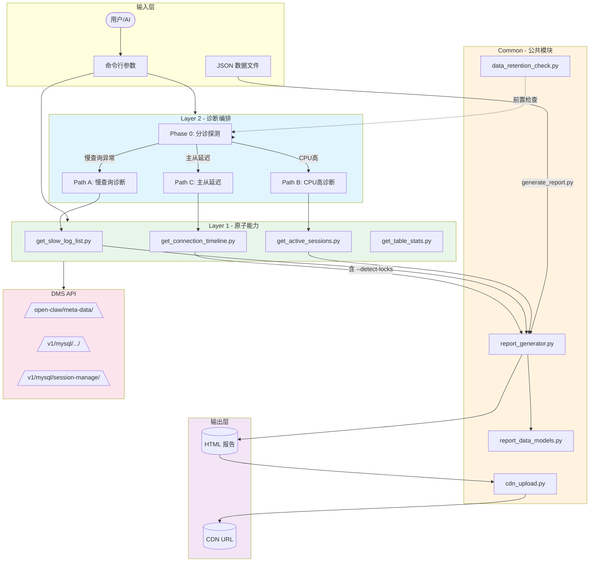

# mysql_cluster_analyze Skill 架构图

## 整体架构

```
┌─────────────────────────────────────────────────────────────────────────┐
│                         mysql_cluster_analyze Skill                      │
│                         MySQL/MyHub 集群诊断 AI 能力                      │
├─────────────────────────────────────────────────────────────────────────┤
│                                                                         │
│  ┌─────────────────────────────────────────────────────────────────┐   │
│  │                                                               │   │
│  │   ┌──────────────┐     ┌──────────────┐     ┌──────────────┐  │   │
│  │   │  Layer 1     │     │  Layer 2     │     │  Report      │  │   │
│  │   │  原子能力     │◄────│  诊断编排     │◄────│  生成器       │  │   │
│  │   │  (Atomic)    │     │  (Phase 0-6) │     │  (Generator) │  │   │
│  │   └──────┬───────┘     └──────┬───────┘     └──────────────┘  │   │
│  │          │                    │                               │   │
│  │          ▼                    ▼                               │   │
│  │   ┌────────────────────────────────────────────────────────┐  │   │
│  │   │                   DMS API 层                            │  │   │
│  │   │  ┌─────────┐  ┌─────────┐  ┌─────────┐  ┌─────────┐   │  │   │
│  │   │  │ open-   │  │   v1/   │  │ session-│  │ monitor │   │  │   │
│  │   │  │ claw    │  │  mysql  │  │ manage  │  │ APIs    │   │  │   │
│  │   │  └─────────┘  └─────────┘  └─────────┘  └─────────┘   │  │   │
│  │   └────────────────────────────────────────────────────────┘  │   │
│  │                                                               │   │
│  └─────────────────────────────────────────────────────────────────┘   │
│                          scripts/                                      │
│                          └── scripts/atomic/, scripts/common/          │
├─────────────────────────────────────────────────────────────────────────┤
│  ┌────────────┐  ┌────────────┐  ┌────────────┐  ┌────────────┐         │
│  │ references │  │  output/   │  │  plans/    │  │   SKILL.md │         │
│  │ 参考资料  │  │  报告输出   │  │  计划文档   │  │  技能规范  │         │
│  └────────────┘  └────────────┘  └────────────┘  └────────────┘         │
└─────────────────────────────────────────────────────────────────────────┘
```

---

## 详细模块架构

```
mysql-cluster-analyze/
│
├── SKILL.md                          # 技能规范（入口文档）
│   ├── Layer 1: 原子能力接口列表
│   ├── Layer 2: 诊断流程（Phase 0-6）
│   └── 触发规则、示例
│
├── scripts/
│   │
│   ├── mysql_monitor.py              # [入口脚本] Layer 2 诊断编排
│   │   ├── Phase 0: 分诊探测
│   │   ├── Path A: 慢查询诊断路径
│   │   ├── Path B: CPU高诊断路径
│   │   ├── Path C: 主从延迟路径
│   │   ├── Path D: 磁盘满路径
│   │   ├── Path E: Crash路径
│   │   └── Path F: 带宽异常路径
│   │
│   ├── atomic/                       # Layer 1: 原子能力脚本
│   │   │
│   │   ├── get_slow_log_list.py      # 慢查询列表
│   │   ├── get_raw_slow_log.py       # 原始慢日志
│   │   ├── get_active_sessions.py    # 活跃连接（双路采集）
│   │   ├── get_connection_timeline.py# [NEW] 连接数时序 + 锁积压检测
│   │   ├── get_table_stats.py        # 表统计信息
│   │   ├── get_index_stats.py        # 索引统计信息
│   │   ├── get_db_connectors.py      # 获取连接器
│   │   ├── explain_sql.py            # SQL 执行计划
│   │   ├── get_slave_status.py       # 主从状态
│   │   ├── get_disk_usage.py         # 磁盘使用
│   │   ├── get_network_traffic.py    # 网络流量
│   │   └── get_system_lock_status.py # 系统锁状态
│   │
│   └── common/                       # 公共模块
│       │
│       ├── report_generator.py       # [NEW] 统一报告生成器
│       │   ├── COMPLETE (蓝色)        # 完整诊断
│       │   ├── MANUAL (绿色)          # 人工分析
│       │   └── LIMITED (紫色)         # 受限分析
│       │
│       ├── report_data_models.py     # [NEW] 报告数据模型
│       │   ├── ReportData
│       │   ├── ReportType
│       │   ├── SlowLogEvent
│       │   ├── ConnectionEvent
│       │   ├── LockEvent
│       │   └── DataGap
│       │
│       ├── generate_report.py        # [NEW] 报告生成入口
│       ├── data_retention_check.py   # [NEW] 数据保留期检查
│       ├── cdn_upload.py             # CDN 上传
│       └── notify.py                 # 通知推送
│
├── references/
│   ├── monitoring_rules.md         # 监控规则（PromQL）
│   └── pitfalls.md                  # 踩坑记录
│
├── plans/
│   └── # 计划文档
│
└── output/
    └── # 报告输出目录
```

---

## 数据流架构

```
                    用户请求
                       │
                       ▼
            ┌─────────────────────┐
            │   命令解析/路由      │
            │  (cluster, node,    │
            │   fault_time, ...)  │
            └──────────┬──────────┘
                       │
        ┌──────────────┼──────────────┐
        │              │              │
        ▼              ▼              ▼
┌──────────────┐ ┌──────────────┐ ┌──────────────┐
│  Layer 2     │ │  Layer 1     │ │ 直接报告     │
│  自动诊断     │ │  原子调用    │ │ 生成入口     │
│              │ │              │ │              │
│ Phase 0 分诊 │ │ --slow-log   │ │ --input      │
│   - 探测 A~F │ │ --sessions   │ │ --cluster    │
│   - 路径选择 │ │ --table-stats│ │ --limited    │
└──────┬───────┘ └──────┬───────┘ └──────┬───────┘
       │                │                │
       └────────────────┼────────────────┘
                        │
                        ▼
           ┌──────────────────────────┐
           │  数据收集与处理           │
           │  - API 调用              │
           │  - 清洗/聚合             │
           │  - 模式识别             │
           └──────────┬───────────────┘
                      │
                      ▼
           ┌──────────────────────────┐
           │  分析引擎                  │
           │  - 根因推理                │
           │  - 事件关联                │
           │  - 置信度评估              │
           └──────────┬───────────────┘
                      │
                      ▼
           ┌──────────────────────────┐
           │  报告生成器                │
           │  - _render_header()        │
           │  - _render_content()       │
           │  - _render_footer()          │
           │                           │
           │  Header 颜色:              │
           │  - 蓝: COMPLETE           │
           │  - 绿: MANUAL             │
           │  - 紫: LIMITED            │
           └──────────┬───────────────┘
                      │
                      ▼
           ┌──────────────────────────┐
           │  输出层                    │
           │  - HTML 报告               │
           │  - JSON 数据               │
           │  - CDN 上传                │
           │  - Webhook 通知            │
           └──────────────────────────┘
```

---

## 核心模块交互关系



---

## 报告类型状态机

```
                    开始
                     │
                     ▼
            ┌─────────────────┐
            │   Phase 0 分诊   │
            │ (数据可用性检查)  │
            └────────┬────────┘
                     │
        ┌────────────┼────────────┐
        │            │            │
        ▼            ▼            ▼
   ┌────────┐  ┌────────┐  ┌────────┐
   │ 数据   │  │ 数据   │  │ 数据   │
   │ 完整   │  │ 部分   │  │ 缺失   │
   └───┬────┘  └───┬────┘  └───┬────┘
       │          │          │
       ▼          ▼          ▼
   ┌────────┐ ┌────────┐ ┌────────┐
   │COMPLETE│ │ MANUAL │ │LIMITED │
   │ (蓝色) │ │ (绿色) │ │ (紫色) │
   │        │ │        │ │        │
   │Layer 2 │ │Layer 1 │ │ 人工 + │
   │自动诊断 │ │人工编排 │ │ 受限   │
   └────────┘ └────────┘ └────────┘
       │          │          │
       └──────────┼──────────┘
                  │
                  ▼
          ┌─────────────┐
          │ 统一HTML报告 │
          └─────────────┘
```

---

## 关键设计模式

| 设计模式 | 应用位置 | 说明 |
|----------|----------|------|
| **模板方法模式** | `ReportGenerator._render()` | 固定流程：header → content → footer |
| **策略模式** | `HEADER_CONFIG` | 不同报告类型使用不同样式策略 |
| **工厂模式** | `generate_limited_report()` | 快速创建特定类型报告 |
| **数据驱动** | `ReportData` dataclass | 结构与渲染分离 |
| **管道模式** | `generate_report.py` CLI | 参数 → 数据 → 渲染 → 输出 |

---

*架构图版本: 2026-04-02*
*对应 MR: !47*
