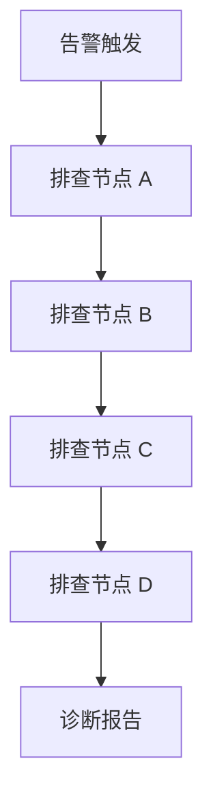
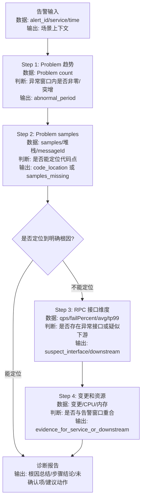

# Guided Builder Workflow

This is the active guidance flow for `diagnosis-skill-builder`. It describes how the Agent should lead the user, not how the generated diagnosis Skill should diagnose.

## Phase 0: Welcome

On first trigger, briefly introduce the Builder and ask for a free-form scene description.

Good opening:

```text
我是业务排障 Skill 创建助手，可以帮你把团队的排障经验沉淀成一个可复用 Skill。
你不用先写 SOP，先用平时的话描述：想为哪个业务/服务/场景创建 Skill？通常由什么触发，比如告警、巡检、用户反馈；核心异常是什么，比如某个业务指标异常、接口耗时升高或任务失败。若有告警链接、规则 ID、指标大盘链接，也可以直接贴。
```

Do not mention internal implementation details such as IR, PQL, CLI, registry, or SkillHub in the opening.

## Phase 1: Scene Intake And Scene Card

Prefer one-message parsing. If the user already gives service, alert/rule, metric, trigger, or severity, extract them immediately and show a Scene Card.

Extract:

- service/system/app
- trigger type: alert, patrol, feedback, manual discovery, mixed
- core anomaly: metric, symptom, direction, threshold if present
- severity: P0/P1/P2/unknown
- known artifact: alert id, rule id, dashboard URL, service name, trace id, SOP doc
- missing fields

Scene Card format:

Default compact format:

```text
我先确认到的场景：
- 业务/服务：...
- 触发来源：...
- 核心异常：...
- 已有关联：...
- 目前还缺：...
```

Use the full table only when the user asks for more detail, when multiple candidates need comparison, or when debugging extraction quality:

| 字段 | 当前值 | 说明 |
| --- | --- | --- |
| 业务/服务 |  | user/artifact |
| 触发来源 |  | user/artifact |
| 核心异常 |  | user/artifact |
| 已有关联 |  | user/artifact |
| 待补信息 |  | builder |

After the card, ask:

```text
这个 Scene Card 对吗？有需要补充或修改的说一下。
同时我会尝试根据已有服务/告警信息补上下文。
```

If information is insufficient, ask only the most useful missing question. Do not ask a full form.

## Phase 2: Minimal Context Lookup

Use concrete context to enrich the Scene Card before asking deep SOP questions. This phase is not diagnosis and must not invent SOP nodes.

Lookup opportunities:

| User Provided | Try To Enrich With |
| --- | --- |
| alert id / rule id / alert title | `xray-alarm` or `xray-cli alarm` |
| service/app | `xray-alarm`, `ones-assistant`, `stability-metadata` |
| dashboard URL | parse URL, `xray-metric-query`/`xray-cli` if supported |

Release/change/RCA/topology/capacity/log/trace lookups are not Scene Card enrichment by default. Use them later only after the user, a SOP artifact, or an accepted Builder suggestion makes them explicit diagnosis nodes.

Limit lookup to what helps identify the scene:

- alert/rule identity, title, level, trigger time, service, owner, trigger condition summary;
- dashboard or document identity and stable link metadata;
- service identity and basic ownership if needed.

Do not run these before the user confirms they are part of the SOP:

- log verification calls;
- trace/logview verification calls;
- change/release correlation verifications;
- metric drilldowns beyond rule/dashboard identification;
- RCA case search;
- topology/capacity/dependency checks.

When lookup succeeds, update Scene Card:

```text
我真实查到了这条告警规则：{rule_id}/{name}，级别 {level}，触发条件是 {condition_summary}。
我把它补到场景里。接下来请补充你们实际怎么排查这个场景。
```

When lookup is blocked:

```text
我尝试读取告警规则，但当前被 {auth/install/permission/input} 阻塞。
先不影响继续采 SOP；后面生成前再补这个链接/权限。
```

Do not pretend lookup succeeded.

Do not continue into evidence verification just because a platform lookup succeeded. The next user-facing step should be asking for or confirming the troubleshooting path.

Do not show a detailed "dependency verification status" table in the normal scene-building flow. If proof matters, use one compact line:

```text
取数真实性：已调用告警/规则查询，返回 rule_id/name/level/conditions；没有使用模拟数据。
```

## Phase 2.5: SOP Document Ingestion

If the user provides a SOP document, runbook, REDoc link, markdown file, Skill package, or other artifact that already contains troubleshooting logic, treat it as first-class input. Do not ask the user to restate the SOP.

Extract from the artifact:

- scene and trigger
- explicit execution principles, such as "无人值守", "一查到底", "原样使用查询", or "不要人工确认"
- diagnosis steps and decision edges
- required vs optional paths
- external data nodes and their locators: PromQL, SQL, dashboard panels, API endpoints, scripts, Skill names, CLI commands, owner/contact tables
- runtime inputs: alert_time, time window, service, scene, metric, payload fields
- strict preservation constraints: query text must remain literal, case-sensitive labels, fixed thresholds
- gaps: missing query, missing dependency, missing owner source, missing output format, non-SOP branches

Then show a compact Scene Card and a diagnosis flow. Ask only for the smallest clarification that affects generated runtime behavior.

Do:

```text
我从文档里抽到了完整 SOP，所以先不让你重新口述。我会直接生成诊断流程，并把缺口标出来。
```

Do not:

```text
上次遇到这个问题你们是怎么一步步排查的？
```

Use the document as `artifact_derived` source. If the user later corrects the flow, mark the corrected part as `user_supplied` or `accepted_suggestion`.

If the artifact contains many PromQL/SQL/API/script nodes, do not immediately claim the Skill is executable and do not run every query during creation. Build a trial-run verification plan:

- optionally run one cheap representative read-only check per datasource or adapter only when it prevents a bad package shape;
- defer full batch verification of required runtime queries to trial run;
- classify each query as `exact_verification_success`, `exact_verification_failed`, `not_verified`, or `manual_gap`;
- preserve literal query text when the artifact requires it.

User-facing wording:

```text
这篇 SOP 里有多条查询。我先把依赖、输入、输出字段、判断规则和失败策略配置好；批量真实取数放到试运行阶段跑。现在不会因为全量验证耗时而卡住创建。
```

If a node has not completed real verification plus judgment, do not show it as bound evidence. Use wording like:

```text
这一步还没有配置完成：我只匹配到了候选取数能力，但还没真实拿到可判断的数据。
```

## Phase 3: SOP Story Collection

After Scene Card is confirmed or sufficiently complete, ask for the troubleshooting story.

Prompt:

```text
上次遇到这个问题，你们是怎么一步步排查的？
先说大概思路就行：先看什么，发现异常后又看什么，最后怎么判断。
```

If user lists directions, do not immediately bind data. First model structure:

- Are these directions sequential or parallel?
- Does any step decide which next step runs?
- Are there manual steps?
- Are there dynamic steps that depend on prior results?
- What are terminal conclusions?

Important: prefer rendering an inferred structure with uncertainty markers over asking many abstract questions.

## Phase 4: Structure Modeling

Immediately render the extracted structure after the user gives a story.

Rules:

- Include only user-supplied, artifact-derived, or accepted-suggestion nodes.
- Use `builder_suggested` for optional generic ideas.
- Mark uncertainty visibly.
- Let the user correct by natural language.

Example response:

````markdown
我先把你说的链路画成这样：



我先理解成按顺序排查。哪些步骤其实是并行看的？
````

If the user says "顺序/并行/分支反了", update only the affected edges.

Default display should be the diagnosis flow, not the Builder phase flow. Avoid showing "场景输入 -> Scene Card -> 平台上下文反查..." unless the user asks where the Builder process currently is.

Node types:

- `data_check`: fetch/analyze data.
- `decision`: branch based on previous result.
- `manual_context`: contact person, read doc, human confirmation.
- `dynamic`: runtime decides which data source/path to use.
- `report`: user-confirmed output step.
- `gate`: trial run/admission.

Complexity:

- If >8 nodes, suggest grouping or ask which nodes are core vs optional.
- If nesting depth >3, suggest splitting into multiple Skills.
- For complex flows, do not show a single oversized diagram. First show an overview Mermaid, then expand branch groups with branch cards and a node table.
- If a flow has many if/else paths, capture the runtime execution policy before packaging: selected decision path, run-all enrichment, stop on first confirmed root cause, or continue with unknown markers.

Execution policy:

- Do not equate "一查到底" with "run every branch". It may mean "do not ask the user at runtime while following the decision tree".
- Explicitly capture whether the generated Skill should:
  - run only the branch selected by decisions;
  - run all independent enrichment paths;
  - stop on first confirmed root cause;
  - continue after partial failures and mark unknowns.
- If an artifact says step 1 narrows a time range for later steps, model that as dynamic runtime state, not as a normal static edge.

## Phase 5: Node Binding

Once the user confirms the structure, guide node-by-node binding.

For each node ask:

```text
Step {N}「{node_name}」需要绑定什么证据？
可以是：指标大盘/图表、业务数据、日志关键词、trace、发布/变更、实验配置、归因链路、容量、RCA case、文档，或者人工步骤。
```

Context reuse:

- If previous node used the same dashboard/platform, ask "还继续用这个大盘里的图表吗？"
- If user says only a chart name, reuse previous dashboard context.
- If user says URL, parse it.
- If no data source is known, ask for the minimum concrete input required for a verification call.

Node statuses:

- `draft`: extracted, not confirmed.
- `confirmed`: user confirmed the node meaning.
- `candidate`: dependency matched but no concrete verification.
- `verified`: interface/input shape checked but no live data.
- `configured_for_trial`: dependency, inputs, expected outputs, judgment, and failure policy are captured.
- `runtime_executable`: trial run returned usable fields and executed the judgment.
- `blocked`: dependency exists but is blocked.
- `missing`: no official capability available.
- `manual`: human step.
- `dynamic`: runtime-routed step.

These statuses are internal. Do not print them in normal conversation. Translate them into user-facing language:

| Internal | User-facing |
| --- | --- |
| candidate/verified | "我先作为候选记录，还差一个具体链接/口径" |
| configured_for_trial | "这个节点已经配置好，待试运行验证" |
| runtime_executable | "这个节点已通过试运行验证" |
| blocked | "这个数据现在还拿不到，先继续采 SOP，生成前再补" |
| missing | "目前没有对应平台能力，需要人工步骤或后续补能力" |

User-facing evidence card for one node:

```markdown
**「{node_name}」证据卡**

| 要判断 | 数据来源 | 定位方式 | 判断条件 |
| --- | --- | --- | --- |
| {business_question} | {dashboard/log/trace/change/experiment/...} | {link/panel/query/service/time_window} | {baseline} {operator} {threshold} |

还缺：{one_missing_field_or_none}
```

For dashboard/panel nodes, require the stable runtime contract before marking configured for trial run:

| Field | Meaning |
| --- | --- |
| `dashboard_url_or_id` | dashboard or chart URL/id |
| `panel_selector` | panel title, panel id, or user-confirmed index |
| `business_metric_name` | human metric or business signal being judged |
| `time_window` | alert window and query window |
| `baseline` | previous window, same time yesterday, week-over-week, threshold line, or user-defined baseline |
| `judgment_rule` | comparator and threshold, e.g. drop_rate > 5% |
| `extraction_method` | API/PQL/query link/browser panel read/manual |
| `fallback` | continue/skip/manual/unknown when data cannot be read |

If the user gives only "第 5 个 panel，5%", record it, but ask for the missing business metric name or panel title:

```markdown
**「{node_name}」证据卡**

| 要判断 | 数据来源 | 定位方式 | 判断条件 |
| --- | --- | --- | --- |
| {business_question} | 大盘 {id} | 第 5 个 panel | 跌幅 > 5% |

还缺：这个 panel 代表的业务字段是什么？
```

## Phase 6: 依赖匹配与轻量预检

For each data-bound node:

1. Match dependency from `platform-capability-registry.yaml`.
2. Check runtime availability.
3. Parse concrete runtime inputs: stable locator/query, time window, baseline, threshold, filters, and required returned fields.
4. Set failure policy for empty data, auth failure, timeout, and missing fields.
5. Optionally run one cheap read-only preflight only when it is necessary to confirm the dependency entrance, parse a dashboard panel, or avoid generating an invalid package.
6. Record full real-data verification as a trial-run task.
7. Update node status.

Node completion gate:

```text
匹配平台能力 -> 解析具体输入 -> 记录期望返回字段 -> 记录判断规则 -> 明确失败策略 -> 进入试运行验证计划
```

During creation, describe such nodes as "已配置，待试运行验证". Only after trial run has fetched real data and executed the judgment rule can a node be described as "已验证可执行".

Keep preflight details internal by default. If the result changes what the user must do, show one sentence:

```text
我已经确认这个节点的调用入口和输入形态；还缺 panel 对应的业务字段名。
```

Show a compact progress table only when the user asks for debug/review details:

| Step | Evidence | Creation Preflight | Trial Verification | Result |
| --- | --- | --- | --- | --- |
| Step 1 | 业务指标大盘 | input shape ready | pending trial run | 已配置待验证 |
| Step 2 | RCM 变更 | auth blocked | pending | 配置阻塞 |

Do not show capability names such as `xray-metric-query` or `query_change` unless the user asks how it will be implemented.

If lookup/search returns nothing, offer exits:

- paste a concrete URL/link/id
- skip and mark `[待补充]`
- treat as manual/dynamic

### Trial-Run Verification Plans

When an artifact contains many data queries, build a compact trial-run verification plan before packaging. Do not spend the whole creation conversation running every query.

Use deferred batch verification when:

- a SOP document includes multiple PromQL/SQL/API queries;
- several nodes share one datasource or adapter;
- the generated Skill must be unattended and should not discover broken queries at production runtime.

Plan fields:

```yaml
batch_verification_plan:
  strategy: creation_preflight_then_trial_run|trial_run_all_required|user_requested_run_now
  groups:
    - adapter: xray-metric-query
      datasource: vms-recommend
      representative_nodes: []
      required_nodes: []
  status_values:
    - exact_verification_success
    - exact_verification_failed
    - not_verified
    - blocked
```

User-facing wording:

```text
我先生成试运行验证清单：哪些查询必跑、要返回哪些字段、怎么判断异常。现在不批量跑，避免创建过程变慢；试运行时再一次性验证。
```

## Phase 6.5: Dependency Bootstrap Preflight

Builder itself is not a dependency installer. It ships a registry and matching rules, but target users may not have every platform Skill/CLI/API installed or authorized in OpenClaw, CC, or another Agent runtime.

After the SOP has enough structure to know real data needs, derive the minimal dependency set:

- include only dependencies required by confirmed nodes or artifact-derived required nodes;
- exclude unused registry capabilities;
- mark optional enrichment dependencies separately;
- keep risky action dependencies, such as restart operations, behind explicit gates.

For each dependency, check or record:

```yaml
dependency_bootstrap:
  dependency_id: ""
  required_by_nodes: []
  required_or_optional: required|optional
  install:
    current_state: installed|missing|unknown
    source: ""              # SkillHub / CodeWizHub / docs / package / CLI install
    install_action: ""      # user action or automated action if supported
  runtime:
    invocation_method: skill|cli|api|adapter|manual
    command_or_entrypoint: ""
    non_interactive: true|false|unknown
  auth:
    state: ready|missing|unknown|failed
    identity_source: ""
    permission_check: ""
    call_authorization: ""
  verification:
    supported: true|false|unknown
    status: not_run|success|blocked|failed
    blocker: ""
  fallback:
    behavior: block_node|mark_unknown|manual_gap|skip_optional
```

User-facing wording should be practical:

```text
这个 SOP 当前只需要 3 类平台能力：指标查询、Darwin 索引切换、变更查询。我会只检查这 3 个，不会要求你安装全量依赖。
```

If a dependency is missing:

```text
「索引切换」节点需要 Darwin 的 index-switch-check。当前环境还没有这个能力，先把它标成依赖缺口；生成 Skill 时会带上安装来源、鉴权要求和输入/输出契约。
```

Do not ask the user to install every dependency before the SOP is known. Do not silently skip preflight before claiming loadability.

### Literal Query Failure UX

If exact literal query/script fails and the artifact forbids rewriting, do not silently fix it. Show a small choice:

```text
这条原样 PromQL 真实验证失败了。我不会自动改写它。
[保留原文并标记阻塞] [生成候选修复但等你确认] [把该节点转人工/缺口]
```

If the user accepts a fix, store both:

- `original_text`: artifact text
- `approved_runtime_text`: user-approved executable text

Never replace artifact text without keeping provenance.

### Missing Adapter Onboarding

If an external dependency is missing, collect an onboarding contract instead of only writing "missing":

| Field | Meaning |
| --- | --- |
| adapter name | e.g. index-switch-check |
| invocation | Skill name, CLI command, API endpoint, or script path |
| required inputs | values emitted by earlier nodes or alert payload |
| expected outputs | fields and example values needed for judgment |
| auth/runtime | token, permission, install path, environment |
| failure policy | blocked, unknown, continue, or stop |

Ask only for the smallest missing field. If the user does not know, keep a runtime dependency gap.

## Phase 7: Flow Confirmation

Keep the flow visible as it matures.

Show:

- flow diagram or structured text
- node detail list with links when relevant
- status legend only when there are mixed configured/blocked/missing/manual nodes

Legend:

```text
✅ 已配置待试运行  🟡 待补输入  ⚠️ 阻塞  ❓ 缺能力  👤 人工  🔄 动态
```

Ask for direct edits:

```text
可以说：
- Step 2 改成并行
- Step 3 的条件反了
- Step 4 标成人工步骤
- Step 2 的图表换成这个链接
- 生成 Skill 草稿
```

## Phase 8: Completeness Score

Score readiness internally. Show the score only when the user asks to generate, asks for readiness, or asks what is still missing.

Suggested scoring:

```yaml
completeness:
  scene_card: 0-20
  sop_structure: 0-25
  data_binding: 0-25
  trial_verification_plan: 0-20
  trial_run_material: 0-10
```

Output:

```text
📊 完整度评估

Scene Card：已确认
SOP 结构：4/4 节点确认
数据绑定：3/4 节点已绑定
试运行验证计划：2/4 节点已配置，1 阻塞，1 缺能力
试运行材料：待补历史 case

综合完整度：72%
建议：先补 Step 3 的图表或确认跳过，再生成。
```

Do not block generation if the user wants a draft; mark risks clearly.

In normal SOP collection turns, do not show completeness scoring. It feels like bookkeeping and interrupts the user's memory recall.

## Phase 9: Full SOP Confirmation Canvas

After the SOP structure, node evidence, judgment rules, outputs, and gaps are captured, show one complete final confirmation canvas before report contract and package generation.

This is different from the earlier lightweight flow. The final canvas must include:

- all confirmed nodes and branch/parallel relationships;
- each node's data source or evidence type;
- the judgment condition;
- the runtime output or variable produced by the node;
- missing/blocked/manual items if any.

Use Mermaid as the primary artifact. Keep node text compact but meaningful:



If the graph is too large, group nodes by stage and use a compact table below the graph only for node details. Do not replace the graph with a long prose list.

Ask for final edits from the canvas:

```text
这是当前完整 SOP 画布。请基于这张图做最后确认：节点、顺序/并行、数据来源、判断条件和输出是否需要改？
```

Allowed edits:

- "Step 2 和 Step 3 并行"
- "这个判断条件改成连续 5 分钟"
- "这里输出 owner，不输出根因"
- "这个节点是人工步骤"
- "这个数据源换成大盘链接"

Only after the user confirms this canvas, move to report contract design.

## Phase 10: Report Contract Design

Before package generation, define the diagnosis report produced by the generated Skill.

Start with the default template:

```text
根因总结（100 字内）：
{确认根因 / 候选根因 / 无法确认根因}

关键步骤结论：
1. {SOP 节点}: {正常/异常/未知/阻塞}; 证据：{关键证据}
2. {SOP 节点}: {正常/异常/未知/阻塞}; 证据：{关键证据}

术语说明（如有）：
- {缩写/黑话}: {一句中文解释}

仍未确认：
- {缺数据 / 缺权限 / 样本为空 / 依赖未验证}

建议动作：
- {下一步 owner/action}
```

Ask one focused question:

```text
我先按这个默认报告模板生成：100 字内根因总结 + 按 SOP 展开的关键步骤结论 + 术语说明 + 未确认项 + 建议动作。需要调整吗？比如更短、加 owner、步骤用表格、隐藏原始数值。
```

If the user says no, use the default. If the user adjusts it, store a `report_contract` with:

- summary length and tone;
- required sections;
- step conclusion format;
- evidence detail level;
- terminology explanation policy;
- unknown/dependency-gap handling;
- owner/action policy;
- notification one-liner if needed.

Do not over-ask. The report contract can be refined later through conversation.

## Phase 11: Package Generation

Generated package should be derived from current IR:

```text
<skill-name>/
├── SKILL.md
├── references/
│   ├── sop.md
│   ├── evidence.md
│   ├── routing.md
│   ├── report-contract.yaml
│   └── trial-cases.yaml
└── scripts/            # optional, only when needed
```

`sop.md`: structure, branches, manual/dynamic steps, output format.
`evidence.md`: node evidence bindings, links, expected fields, thresholds, verification result.
`routing.md`: node to platform Skill/CLI mapping, fallback, runtime availability.
`report-contract.yaml`: default or user-adjusted report template and output schema.
`trial-cases.yaml`: historical or synthetic cases from user-confirmed expectations.

User-facing output after generation should be outcome-first and short:

```text
Skill 草稿已生成。

| 产物 | 状态 |
| --- | --- |
| 诊断流程 | 已生成 |
| 依赖清单 | 已生成 |
| 报告模板 | 已生成 |
| 单次执行检查 | 待执行 |

下一步我执行一次这个 Skill，确认能不能跑通。
```

Do not mention duplicate local folders, file-system reconciliation, YAML parsing, structural validation, or package implementation details unless the user asks for debug details or an error requires action.

## Phase 12: 单次执行检查

After package generation, do not stop at "files created". Run or prepare one invocation of the generated Skill.

Purpose:

- prove the generated Skill entrypoint loads;
- prove input parsing and routing work;
- prove dependency blockers are surfaced as blockers/unknowns;
- prove a structured report can be rendered;
- catch broken packaging before trial run/admission.

This is a runnable execution check, not quality admission and not full real-data verification.

Use this order:

1. Select one payload: historical alert, discovered alert context, or synthetic input from schema.
2. Invoke the generated Skill entrypoint if the current runtime supports it.
3. Capture whether route selection, node orchestration, dependency fallback, and report rendering worked.
4. If the current runtime cannot invoke it, record `execution_check.status=blocked` with the exact blocker and next action.

User-facing wording:

```text
Skill 文件已经生成。下一步我先执行一次这个 Skill，确认入口、路由和报告能跑通；这一步只验证“能不能跑”，不代表准入质量通过。
```

Execution result card:

```text
单次执行结果：
- 入口加载：通过/失败
- 输入解析：通过/失败
- 路由路径：...
- 报告输出：通过/失败
- 阻塞项：...
```

## Phase 13: Trial Run And Admission

Prepare trial-run materials from current IR.

试运行比单次执行检查更完整：它会基于用户确认的历史/合成 case，执行延后的真实取数验证和判断规则。

Keep `Skill Evaluator / 准入 Agent` as placeholder:

```yaml
admission:
  skill_evaluator:
    status: placeholder
    note: "独立准入 Agent 孵化中；当前只准备输入材料，不宣称已通过准入。"
```

If the user asks to run now, run only available read-only verification calls or generated local tests; mark blocked/missing honestly.
