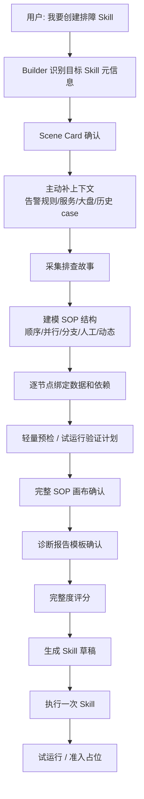
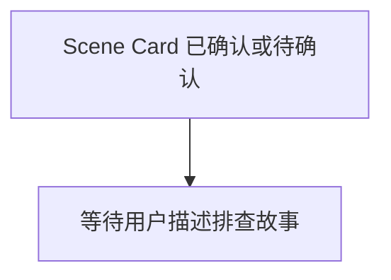
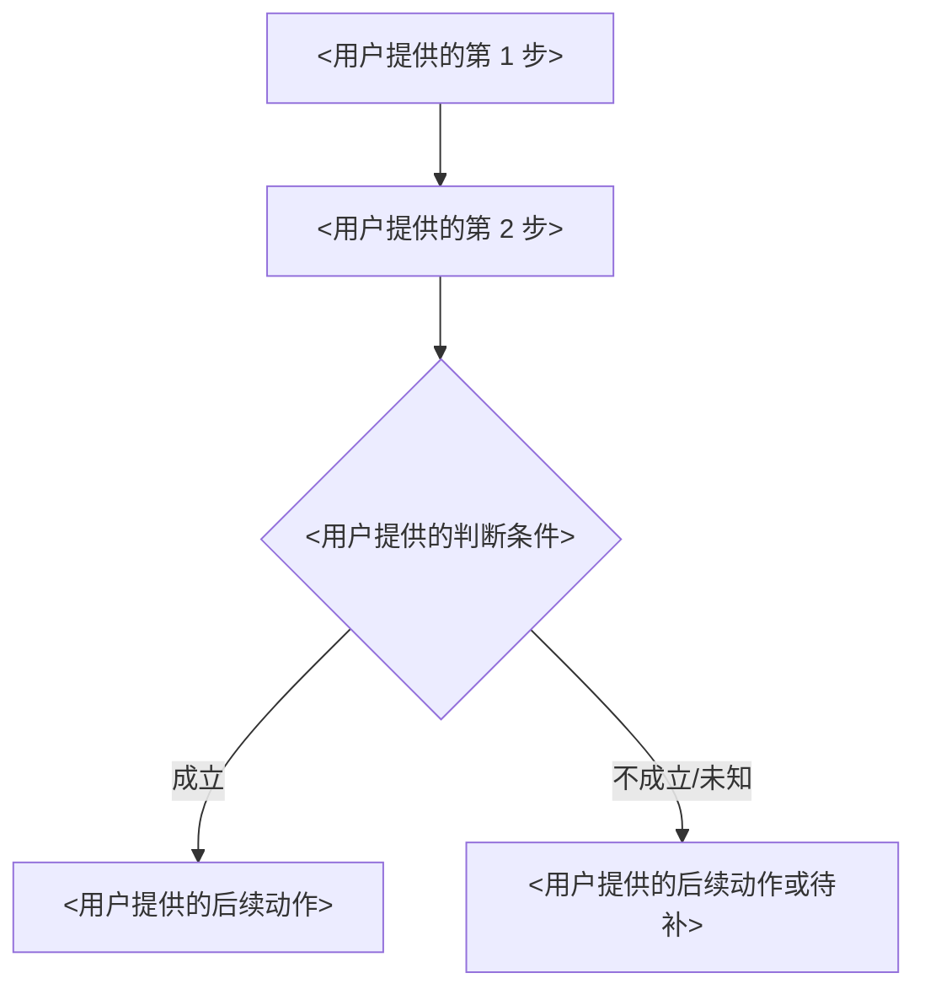
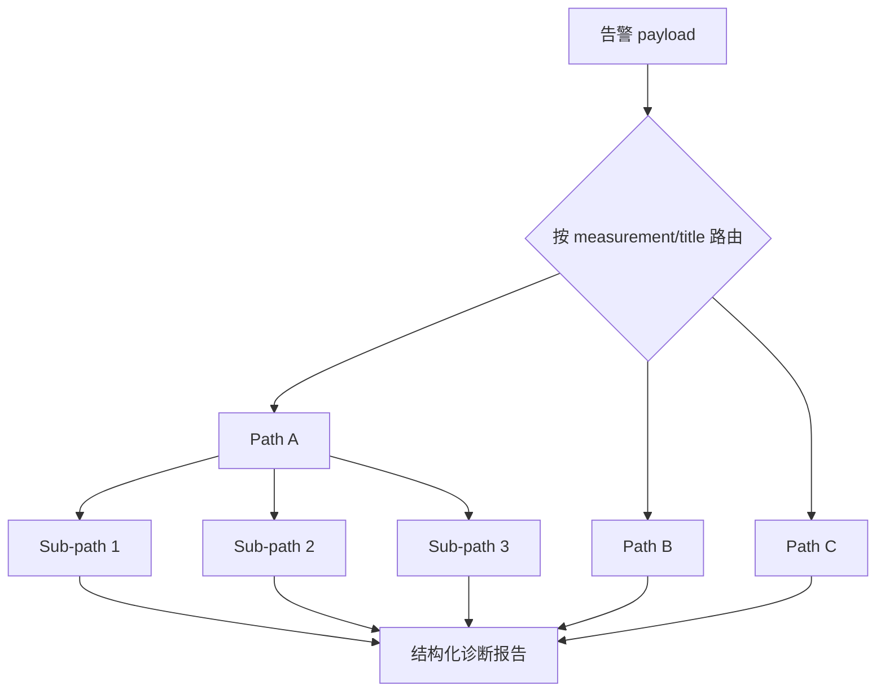
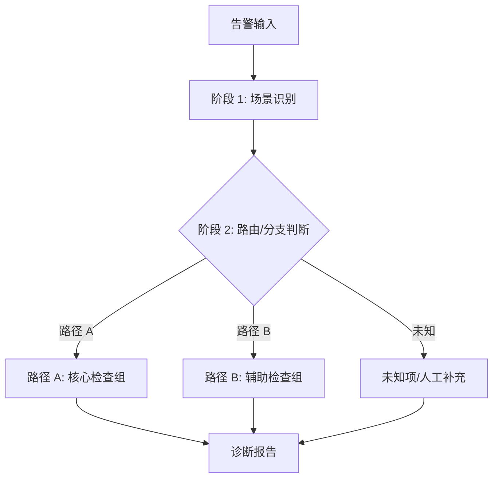
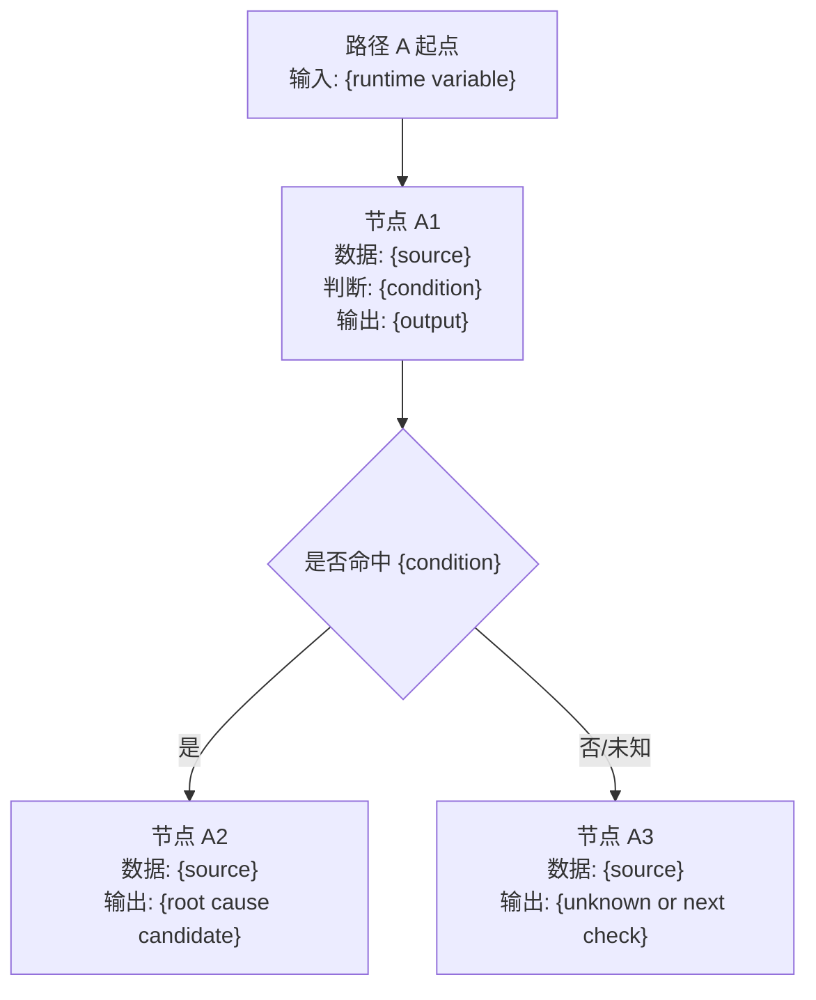
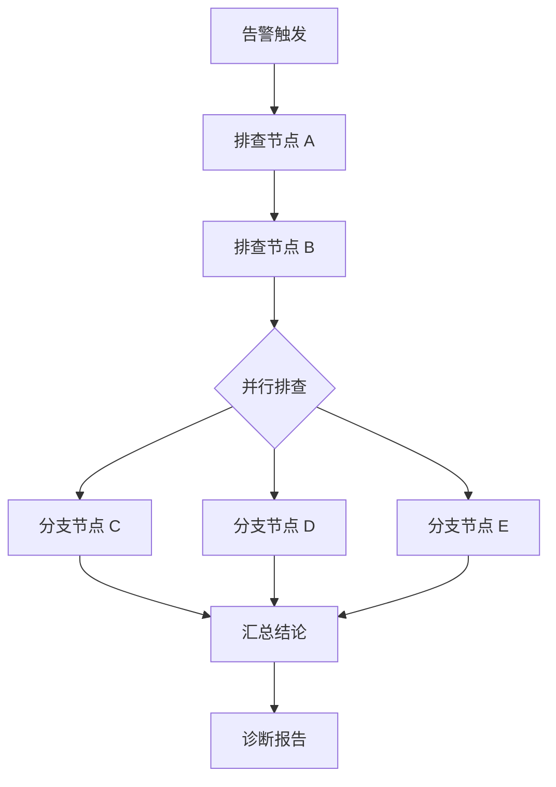
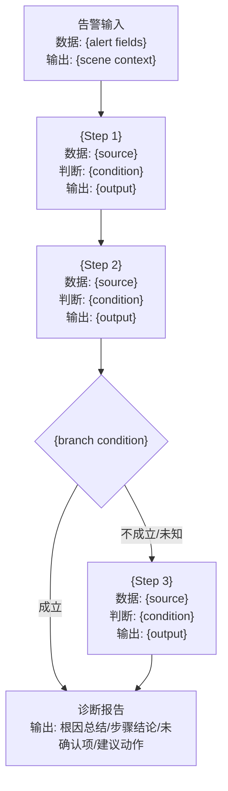
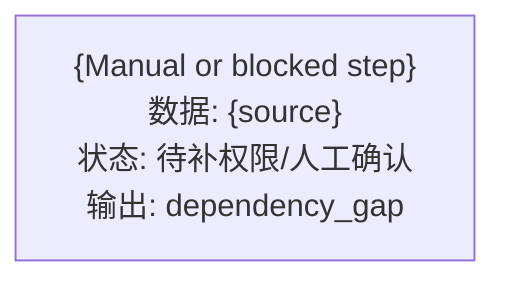

# Visualization Templates

Use these outputs inside the conversation. They are not a separate UI.

The Builder must not show a fixed diagnosis flow before the user has supplied the SOP. Visualizations should start from a Scene Card and grow into a user-confirmed diagnosis flow.

## Visual Interaction Rule

Less internal detail does not mean less visual structure. In normal Builder turns:

- Use a card-style block for Scene confirmation.
- Use Mermaid for diagnosis flow and branch confirmation.
- Use a node card for evidence binding.
- Use small option lists/chips for user choices.
- Avoid raw code-block flow lists like `A -> B -> C` unless Mermaid rendering is unavailable.

## Scene Card

Use this before SOP collection:

Default compact view:

**场景确认**

| 业务/服务 | 触发来源 | 核心异常 | 已有关联 |
| --- | --- | --- | --- |
| {service_or_system} | {trigger} | {anomaly} | {alert_rule_dashboard_case} |

下一步只缺：{missing_for_next_step}

Detailed table only for candidate comparison or extraction debugging:

| 字段 | 当前值 | 说明 |
| --- | --- | --- |
| 业务/服务 |  | user/artifact |
| 触发来源 |  | user/artifact |
| 核心异常 |  | user/artifact |
| 严重级别 |  | artifact if known |
| 已有关联 |  | link/id/rule/dashboard |
| 待补信息 |  | next needed user input |

## Builder Incubation Flow

Use this only when the user asks where the Builder process is, or when a long session needs orientation. Do not show it by default after every update.



## Empty Diagnosis Flow

Use this as the first diagnosis artifact when no SOP step has been supplied:



## User-Derived Diagnosis Flow

Only include nodes that came from user statements, concrete artifacts, or explicitly accepted suggestions:



## Route Table Card

Use this when a Skill covers a family of related alerts and needs dispatch from alert payload to path.

| 告警/measurement | 诊断路径 | 关键数据 | 备注 |
| --- | --- | --- | --- |
| `<measurement or keyword>` | `<path>` | `<table / fields>` | `<fallback or special rule>` |

Then ask:

```text
这些路由覆盖完整吗？未命中时走哪个兜底路径？
```

## Multi-Path Diagnosis Flow

Use this for router-style Skills:



When the policy is "命中也继续跑", show sub-paths as fan-out into the report instead of early-stop branches.

## Complex Flow Rendering

When a diagnosis flow has many branches, if/else conditions, or more than 8 nodes, do not force every detail into one giant diagram. Use layered views:

1. Overview diagram: show only the major phases, branch groups, and terminal reports.
2. Branch cards: expand one branch group at a time with its data source, judgment condition, and output.
3. Node table: list detailed evidence bindings and missing fields for scanability.

Default threshold:

- `<= 8` nodes: one Mermaid diagram is acceptable.
- `9-15` nodes or multiple if/else branches: overview Mermaid + node table.
- `> 15` nodes, route tables, or nested conditions deeper than 3: overview Mermaid + per-branch subgraphs. Suggest splitting into multiple diagnosis Skills if the branches are independent runtime paths.

Overview template:



Branch detail template:



Use Mermaid `subgraph` only when it improves readability. Keep labels short; put detailed evidence in the node table rather than inside oversized diagram nodes.

Sequential-plus-parallel example:



If the relationship is uncertain, put the uncertainty in the question, not by dumping text:

```text
我先画成串行：节点 A -> 节点 B -> 节点 C。哪些步骤其实是并行看的？
```

## Full SOP Confirmation Canvas

Use this after all SOP nodes and node bindings are captured, before report contract and package generation. This is the final user confirmation artifact.

Each node should include:

- node name;
- data/evidence source;
- judgment condition;
- output or next variable;
- missing/blocked marker if relevant.

Template:



If a node is blocked or manual:



Prompt:

```text
这是当前完整 SOP 画布。请基于这张图做最后确认：节点、顺序/并行、数据来源、判断条件和输出是否需要改？
```

Do not show internal dependency ids or runtime status labels unless the user asks for implementation details.

## Node Table

Default user-facing table:

| 节点 | 要判断什么 | 证据来源 | 判断条件 | 下一步 |
| --- | --- | --- | --- | --- |
| <step> | <business question> | <dashboard/log/trace/change/...> | <rule or missing> | <branch/continue> |

Detailed internal table only when debugging Builder behavior:

| Node | Source | Purpose | Evidence Needed | Dependency | 验证 | Judgment | Next | Status |
| --- | --- | --- | --- | --- | --- | --- | --- | --- |
| step_001 | user_supplied | <what this step answers> | <data/link/artifact> | <matched skill/cli> | candidate/verified/configured_for_trial/runtime_executable/blocked/missing | <rule> | <branch/continue> | draft |

Source values:
- `user_supplied`: directly stated by user.
- `artifact_derived`: extracted from alert, dashboard, SOP doc, trace, case, or link.
- `builder_suggested`: suggested by Builder and not yet accepted.
- `accepted_suggestion`: Builder suggestion explicitly accepted by user.

## Suggestion Format

When Builder has a useful generic suggestion, label it clearly and do not insert it as a mandatory node:

```text
可选建议：很多指标类告警会先做数据延迟/口径检查。要不要把它加入这个 Skill？
如果加入，我会把它标成 builder_suggested，等你确认后才进入正式流程。
```

## Confirmation Prompts

Use targeted prompts:

- "这个 Scene Card 对吗？我会先用服务/告警信息补上下文，再问排查链路。"
- "我查到了告警规则，已补全严重级别和触发条件。接下来请说你们上次怎么排查。"
- "我只抽取了你刚才明确说的 2 个节点，没有加通用误报/变更检查。顺序对吗？"
- "这个节点需要什么具体输入才能做真实验证：指标名、大盘链接、服务名，还是 trace id？"
- "这个判断条件是你确认的规则，还是我先作为候选建议保留？"
- "查不到数据时，这个节点应该继续、跳过、降级，还是终止？"

## Evidence Binding Card

Use this when the user binds a concrete source to a node. This keeps the conversation grounded without exposing platform implementation details.

**「{node_name}」证据卡**

| 要判断 | 数据来源 | 定位方式 | 判断条件 | 运行方式 |
| --- | --- | --- | --- | --- |
| {business_question} | {evidence_kind}: {link_or_identifier} | {panel/query/filter/service/time_window} | {baseline} {operator} {threshold} | {Skill/CLI/API/脚本/人工} |

还缺：{one_missing_field_or_none}

Examples:

**「{节点名称}」证据卡**

| 要判断 | 数据来源 | 定位方式 | 判断条件 |
| --- | --- | --- | --- |
| {节点要判断的问题} | {平台/大盘/日志/SQL/API} | {稳定定位方式} | {相对基线/阈值/判断规则} |

还缺：对比基线是告警前同长窗口、昨天同期，还是别的口径？

## 验证 Plan Card

Use this when a SOP document contains many PromQL/SQL/API/script nodes.

| 分组 | 代表性查询 | 必跑查询数 | 当前状态 | 下一步 |
| --- | --- | --- | --- | --- |
| {adapter/datasource} | {node/query name} | {count} | {代表性验证通过 / 失败 / 未验证} | {批量真实验证 / 修复原样查询 / 标记缺口} |

Keep the wording user-facing:

```text
我先生成试运行验证清单；创建阶段不批量跑，试运行时再验证所有必跑查询。
```

## Node Completion Gate Card

Use this when the user asks whether a node is truly configured, or when a previous artifact might imply an incomplete node is complete.

| 检查项 | 结果 |
| --- | --- |
| 平台能力匹配 | {real Skill/CLI/API/adapter or missing} |
| 具体输入解析 | {query/panel/service/time window/baseline} |
| 期望返回字段 | {fields or missing fields} |
| 判断规则 | {rule / missing} |
| 失败策略 | {continue/unknown/stop/manual/blocker} |
| 试运行验证 | {planned / already passed / blocked} |

Conclusion wording:

- Draft-ready: "这个节点已经配置好，可以进入 Skill 草稿；真实取数放到试运行验证。"
- Runtime complete: "这个节点已经通过试运行验证，可以进入无人值守运行逻辑。"
- Incomplete: "这个节点还不能算配置完成，因为 {one blocker}。"
- Blocked: "这个节点当前阻塞，运行时只能作为 dependency gap 输出。"

## Incomplete Node Card

Use this when a node is not ready for unattended runtime execution.

| 节点 | 当前已知 | 为什么不能算完成 | 下一步 |
| --- | --- | --- | --- |
| {node} | {candidate capability / locator / query} | {未验证 / 缺字段 / 缺依赖 / 判断未执行} | {minimum next action} |

## Literal Failure Card

Use this when exact artifact query/script fails.

| 节点 | 原样内容 | 失败原因 | 当前处理 |
| --- | --- | --- | --- |
| {node} | {short exact query label} | {error summary} | 不自动改写 |

Choices:

```text
[保留原文并标记阻塞] [生成候选修复但等你确认] [转成人工/缺口]
```

## Execution Check Card

Use this after the generated Skill package is created. Keep it separate from trial run and admission.

**单次执行结果**

| 检查项 | 结果 |
| --- | --- |
| 入口加载 | {通过/失败/阻塞} |
| 输入解析 | {通过/失败} |
| 路由路径 | {path or unknown} |
| 依赖处理 | {called/skipped/blocked/gap} |
| 报告输出 | {通过/失败} |

结论：{能跑通 / 被阻塞 / 需要修包}

User-facing reminder:

```text
这一步只验证 Skill 能不能被调用并输出报告，不等于准入质量通过。
```

## Report Contract Card

Use this when the Builder confirms or edits the generated Skill's diagnosis report format.

**诊断报告模板**

| 区块 | 默认规则 | 可调整项 |
| --- | --- | --- |
| 根因总结 | 100 字内，明确“确认/疑似/无法确认” | 长度、语气、是否一行 |
| SOP 步骤结论 | 按执行步骤列出正常/异常/未知/阻塞 | 列表/表格/JSON、是否展示原始数值 |
| 术语说明 | 首次出现缩写/黑话时用中文解释 | 是否展示、解释详细程度 |
| 未确认项 | 展示缺数据、缺权限、样本为空、依赖缺口 | 是否隐藏、是否分级 |
| 建议动作 | 输出下一步 owner/action（如已配置） | 是否包含 owner、是否适合告警通知 |

Prompt:

```text
我先用默认报告模板：100 字内根因总结 + 按 SOP 展开的关键步骤结论 + 术语说明 + 未确认项 + 建议动作。需要调整吗？
```

## Missing Adapter Card

Use this when an external Skill/CLI/API/script is needed but unavailable.

| 依赖 | 调用方式 | 需要输入 | 期望输出 | 当前处理 |
| --- | --- | --- | --- | --- |
| {adapter} | {skill/cli/api/script or unknown} | {inputs} | {outputs} | 依赖缺口 |

## Choice Chips

When asking for a small decision, show compact choices instead of a long paragraph.

Examples:

```text
这些步骤的关系是？
[全部串行] [前两步串行，后面并行] [全部并行] [我直接改]
```

```text
这个节点的数据类型是？
[指标大盘] [业务报表] [日志] [Trace] [变更] [实验] [归因] [SQL/API/脚本] [人工确认]
```

```text
对比基线是？
[告警前同长窗口] [昨天同期] [上周同期] [固定阈值] [我补充]
```

```text
这个 Skill 覆盖范围是？
[单个告警] [同类多告警路由] [多业务场景] [我补充]
```

```text
Sub-path 运行策略是？
[全部跑完] [命中后停止] [按条件运行] [我补充]
```

## Compact 验证 Proof

Use one line only when the user challenges realism, asks whether data can really be fetched, or the blocker changes the next action:

```text
取数真实性：已调用 {platform/action}，返回 {fields}; {blocked_or_missing_if_any}。
```

Do not show long verification tables in normal Builder turns.

## Completeness View

Use only when the user asks to generate, asks "还缺什么", or asks for readiness.

```text
📊 完整度评估

Scene Card：{confirmed/draft}
SOP 结构：{confirmed_nodes}/{total_nodes} 节点确认
数据绑定：{bound_nodes}/{total_nodes} 节点已绑定
试运行验证计划：{configured}/{total_nodes} 已配置，{blocked} 阻塞，{missing} 缺能力
试运行材料：{ready/missing}

综合完整度：{score}%
建议：{next best action}
```
