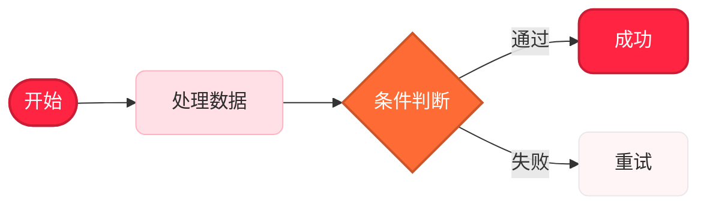
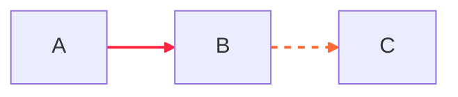
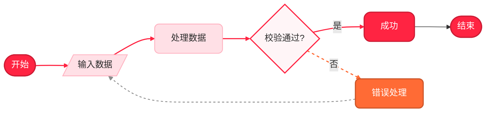
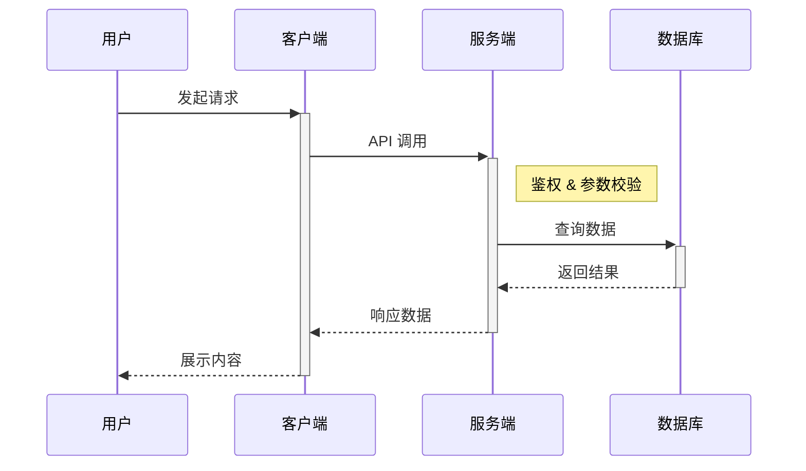
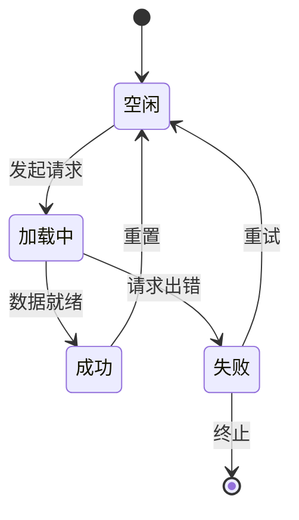
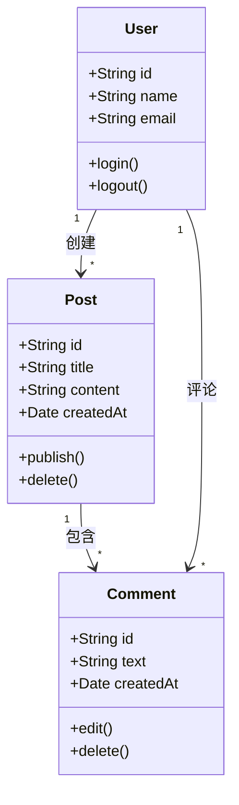
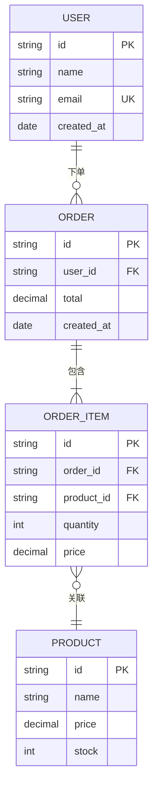

# Pretty Mermaid

生成专业精美的 Mermaid 图表代码。所有样式通过 Mermaid 原生 `%%{init}%%` 指令和内联 `style` / `classDef` 实现，无需任何外部渲染工具。生成的 `.mmd` 文件可直接在 GitHub、Markdown 编辑器、Mermaid Live Editor 等任意支持 Mermaid 的环境中展示。

---

## 核心原则

1. **只生成 .mmd 代码** — 不涉及 SVG / PNG / ASCII 等外部渲染
2. **内联美化** — 通过 Mermaid 原生的 `%%{init}%%`、`classDef`、`style` 实现样式
3. **品牌色系优先** — 默认使用小红书品牌色系，保证输出高级、统一
4. **开箱即用** — 生成的代码可直接粘贴到任何 Mermaid 渲染环境
5. **纯文字标签** — 节点和连线文字中**禁止使用 Emoji**，保持专业简洁
6. **防止文字溢出** — 节点文字应简短精炼，结合合理的节点形状和内边距，确保文字不会超出节点边界

---

## 工作流

**第 1 步：确认图表类型**
- **流程/工作流/决策** → 流程图（flowchart）
- **API 调用/交互/消息** → 时序图（sequenceDiagram）
- **状态/生命周期** → 状态图（stateDiagram-v2）
- **对象模型/类设计** → 类图（classDiagram）
- **数据库模型** → ER 图（erDiagram）

**第 2 步：选择配色方案**
- 查看 [配色方案参考](#配色方案参考) 选择合适的方案
- 默认使用 **薯红经典（redbook-classic）** 方案

**第 3 步：生成带样式的 .mmd 代码**
- 使用 `%%{init}%%` 设置全局主题配置
- 使用 `classDef` / `style` 设置节点样式
- 参考 [示例模板](#示例模板) 中的写法

**第 4 步：输出 .mmd 文件**
- 将代码保存为 `.mmd` 文件
- 用户可在任意 Mermaid 渲染环境中查看

---

## 配色方案参考

所有配色方案均以小红书品牌色为基底，衍生出适合不同场景的专业配色。

详细色值和用法请参阅 [THEMES.md](references/THEMES.md)。

### 薯红经典（redbook-classic）⭐ 默认推荐

以小红书标志性红色为主色调，温暖而专业。适合大多数场景。

| 角色 | 色值 | 说明 |
|------|------|------|
| 主色 | `#FF2442` | 小红书品牌红，用于关键节点/强调 |
| 深红 | `#CC1D35` | 主色加深，用于边框/悬停 |
| 暖橙 | `#FF6B35` | 活力橙，用于次要节点 |
| 柔粉 | `#FFE0E6` | 浅粉色，用于浅色节点背景 |
| 浅底 | `#FFF5F7` | 极浅粉底色 |
| 深底 | `#2D2D2D` | 深色文字/深色模式背景 |
| 白色 | `#FFFFFF` | 浅色节点上的背景或深色节点上的文字 |
| 线色 | `#8C8C8C` | 连接线/箭头 |

### 玫瑰高级（rose-premium）

以红棕与玫瑰色为核心的高级质感配色，适合商务报告和正式场合。

| 角色 | 色值 | 说明 |
|------|------|------|
| 主色 | `#E8364F` | 玫瑰红 |
| 深红 | `#B8293E` | 深玫瑰 |
| 暖棕 | `#C67A5C` | 温暖棕色 |
| 米金 | `#F5E6D3` | 暖米色背景 |
| 浅底 | `#FBF7F4` | 极浅暖色底 |
| 墨色 | `#1A1A2E` | 深色文字 |
| 白色 | `#FFFFFF` | 背景/反色文字 |
| 线色 | `#9E8E82` | 暖灰连线 |

### 珊瑚活力（coral-vibrant）

明亮活泼的珊瑚色系，适合产品演示和创意型图表。

| 角色 | 色值 | 说明 |
|------|------|------|
| 主色 | `#FF4757` | 珊瑚红 |
| 辅色 | `#FF6B81` | 浅珊瑚 |
| 橙色 | `#FFA502` | 活力橙 |
| 浅底 | `#FFF1F2` | 浅珊瑚底 |
| 薄荷 | `#E8F8F5` | 薄荷绿辅助底色 |
| 深灰 | `#2F3542` | 深色文字 |
| 白色 | `#FFFFFF` | 背景 |
| 线色 | `#747D8C` | 中灰连线 |

### 深红暗夜（dark-crimson）

暗色模式配色，适合技术文档和开发者偏好的深色界面。

| 角色 | 色值 | 说明 |
|------|------|------|
| 主色 | `#FF2442` | 品牌红 |
| 暗红 | `#A61D30` | 深沉暗红 |
| 暗橙 | `#D4603A` | 暗橙色 |
| 面色 | `#2A1F2D` | 深紫灰节点面 |
| 背景 | `#1A1520` | 极深背景 |
| 亮文 | `#F0E6F0` | 浅色文字 |
| 边框 | `#4A3F50` | 暗色边框 |
| 线色 | `#6B5B73` | 暗紫灰连线 |

---

## Mermaid 样式化技法

### 1. 全局主题初始化（%%{init}%%）

通过 `%%{init}%%` 设置全局主题变量，这是最重要的美化手段：

```mermaid
%%{init: {
  'theme': 'base',
  'themeVariables': {
    'primaryColor': '#FF2442',
    'primaryTextColor': '#FFFFFF',
    'primaryBorderColor': '#CC1D35',
    'secondaryColor': '#FFE0E6',
    'secondaryTextColor': '#2D2D2D',
    'secondaryBorderColor': '#FFB3C1',
    'tertiaryColor': '#FFF5F7',
    'tertiaryTextColor': '#2D2D2D',
    'tertiaryBorderColor': '#FFD6DE',
    'lineColor': '#8C8C8C',
    'textColor': '#2D2D2D',
    'fontSize': '13px',
    'fontFamily': '"PingFang SC", "Hiragino Sans GB", "Microsoft YaHei", sans-serif'
  },
  'flowchart': {
    'nodeSpacing': 30,
    'rankSpacing': 50,
    'padding': 15,
    'wrappingWidth': 120
  }
}}%%
```

> **关键参数说明：**
> - `fontSize: '13px'` — 适中字号，减少文字溢出风险
> - `padding: 15` — 节点内边距，文字与边框间留出空间
> - `wrappingWidth: 120` — 超过此宽度的文字自动换行
> - `nodeSpacing` / `rankSpacing` — 节点之间的间距，避免拥挤

### 2. classDef 定义样式类

为不同类型的节点定义样式类，然后通过 `:::className` 语法应用：



### 3. style 单独设置

对特定节点进行个别样式覆盖：


### 4. 连接线样式

通过 `linkStyle` 美化连接线：



### 5. 圆角技巧

使用 `rx` 和 `ry` 给节点添加圆角，让图表更加现代化：
- `rx:12,ry:12` — 大圆角，胶囊形
- `rx:8,ry:8` — 中圆角，圆润矩形
- `rx:4,ry:4` — 小圆角，微圆角

---

## 示例模板

### 流程图 — 薯红经典配色



### 时序图 — 玫瑰高级配色



### 状态图 — 珊瑚活力配色



### 类图 — 薯红经典配色



### ER 图 — 深红暗夜配色



---

## 图表类型参考

完整语法和最佳实践请参阅 [DIAGRAM_TYPES.md](references/DIAGRAM_TYPES.md)。

### 快速语法速查

| 图表类型 | 关键字 | 适用场景 |
|---------|--------|---------|
| 流程图 | `flowchart LR/TB` | 流程、工作流、决策树 |
| 时序图 | `sequenceDiagram` | API 调用、交互、消息流 |
| 状态图 | `stateDiagram-v2` | 应用状态、生命周期 |
| 类图 | `classDiagram` | 对象模型、架构设计 |
| ER 图 | `erDiagram` | 数据库模式、数据模型 |

---

## 美化最佳实践

### 配色选择
- **通用场景** → 薯红经典（redbook-classic）⭐
- **正式商务** → 玫瑰高级（rose-premium）
- **产品演示 / 创意** → 珊瑚活力（coral-vibrant）
- **技术文档 / 深色模式** → 深红暗夜（dark-crimson）

### 视觉提升技巧
1. **使用圆角**：`rx:12,ry:12` 让节点更现代，避免生硬的直角
2. **层次分明**：主节点用深色填充 + 白色文字，辅助节点用浅色填充 + 深色文字
3. **禁止使用 Emoji**：节点文字和连线标签中不使用任何 Emoji 字符，保持专业简洁
4. **连线差异化**：主流程用实线加粗，异常/回退路径用虚线
5. **控制节点数量**：单张图建议不超过 15 个节点，保持清晰
6. **有意义的标签**：每条连线都附上文字说明
7. **留白得当**：使用子图（subgraph）对复杂流程进行分组

### 防止文字溢出
节点中的文字超出节点边界是最常见的图表美观问题。务必遵循以下规则：

1. **文字要短**：每个节点文字控制在 **2-6 个中文字**（或 4-12 个英文字符），避免长句
2. **字号不要太大**：使用 `fontSize: '13px'` 或 `'14px'`，不要超过 `'16px'`
3. **设置内边距**：在 `%%{init}%%` 中配置 `'padding': 15` 以增加节点内部留白
4. **设置换行宽度**：配置 `'wrappingWidth': 120` 启用自动换行
5. **合理选择节点形状**：
   - 圆角矩形 `[文字]` — 最通用，适合大多数文字长度
   - 体育场形 `([文字])` — 适合短文字（2-4字）
   - 菱形 `{文字}` — 仅适合极短文字（2-4字），菱形空间最小
   - 平行四边形 `[/文字/]` — 适合中等长度文字
6. **长文字拆分**：如果内容较多，拆成多个节点或使用 subgraph 分组
7. **避免在菱形节点中写长文字**：判断条件应极度精简，如"通过?"、"有效?"

### 字体推荐
- 中文环境：`"PingFang SC", "Hiragino Sans GB", "Microsoft YaHei", sans-serif`
- 代码/技术图：`"JetBrains Mono", "Fira Code", monospace`

### 生成检查清单
- [ ] 是否添加了 `%%{init}%%` 全局主题配置（含 `padding` 和 `wrappingWidth`）？
- [ ] 关键节点是否使用了 `classDef` 或 `style` 美化？
- [ ] 连接线是否通过 `linkStyle` 设置了颜色和粗细？
- [ ] 节点是否使用了 `rx`/`ry` 圆角？
- [ ] 整体配色是否一致、层次分明？
- [ ] 所有节点文字是否足够简短（2-6 个中文字）？
- [ ] 菱形节点文字是否极度精简（2-4字）？
- [ ] 是否有任何 Emoji 字符？（不应出现）
- [ ] 代码能否在 Mermaid Live Editor 中正确渲染？

---

## 常见问题

### 如何切换配色方案？
修改 `%%{init}%%` 中的 `themeVariables` 色值，以及 `classDef` 中的填充色和边框色即可。参考 [THEMES.md](references/THEMES.md) 中的色值表。

### 为什么选择 `theme: 'base'`？
`base` 主题允许完全自定义所有颜色变量，不受预设主题干扰。这样可以精确控制每个元素的颜色。

### 圆角不生效？
`rx` 和 `ry` 仅在部分渲染器中支持（如 SVG 渲染）。在不支持的环境中会被忽略，不影响图表功能。

### 文字超出节点边界怎么办？
1. 缩短节点文字（控制在 2-6 个中文字以内）
2. 在 `%%{init}%%` 中增大 `padding` 值（如 `'padding': 20`）
3. 将 `fontSize` 调小（如 `'13px'` 或 `'12px'`）
4. 避免在菱形 `{}` 节点中写超过 4 个字的文字
5. 使用 `wrappingWidth` 启用自动换行

---

## 资源清单

### references/
- `THEMES.md` - 详细配色方案参考，包含完整色值和使用场景
- `DIAGRAM_TYPES.md` - 全部图表类型的完整语法指南

### assets/
- `example_diagrams/flowchart.mmd` - 流程图模板（含样式）
- `example_diagrams/sequence.mmd` - 时序图模板（含样式）
- `example_diagrams/state.mmd` - 状态图模板（含样式）
- `example_diagrams/class.mmd` - 类图模板（含样式）
- `example_diagrams/er.mmd` - ER 图模板（含样式）
