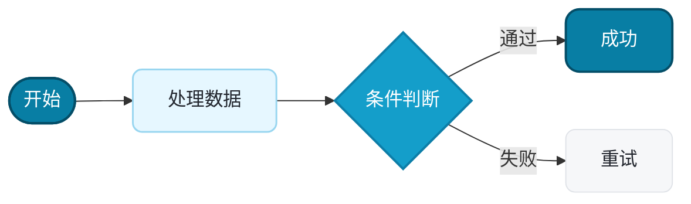
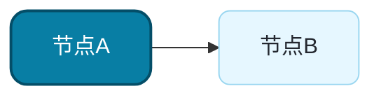
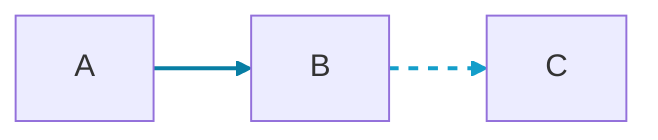
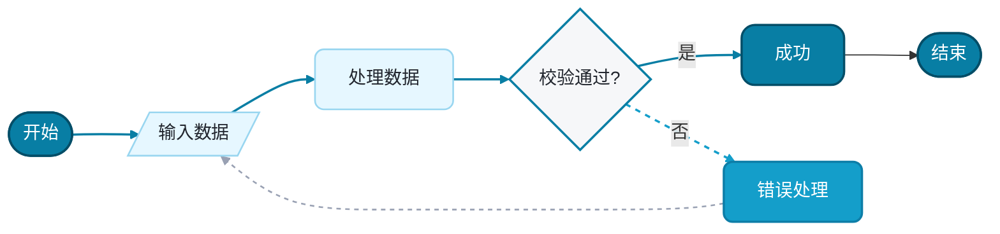
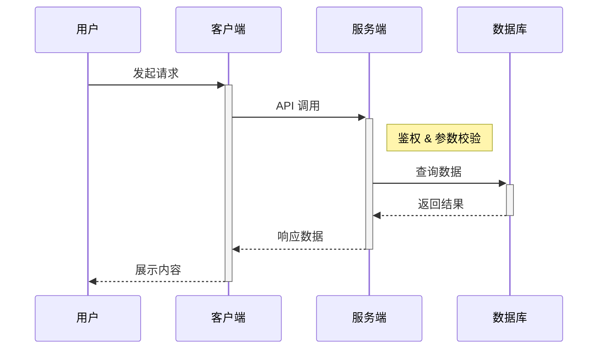
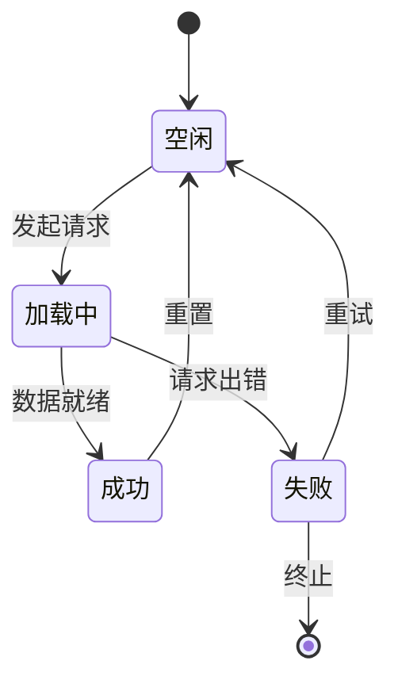
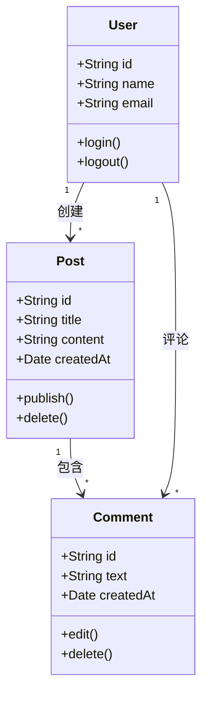
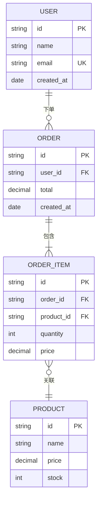

# Pretty Mermaid

生成专业精美的 Mermaid 图表代码。所有样式通过 Mermaid 原生 `%%{init}%%` 指令和内联 `style` / `classDef` 实现，无需任何外部渲染工具。生成的 `.mmd` 文件可直接在 GitHub、REDoc、Mermaid Live Editor、Markdown 编辑器等任意支持 Mermaid 的环境中展示。

---

## 核心原则

1. **只生成 .mmd 代码** — 不涉及 SVG / PNG / ASCII 等外部渲染
2. **内联美化** — 通过 Mermaid 原生的 `%%{init}%%`、`classDef`、`style` 实现样式
3. **默认蓝白配色** — 未指定时一律使用「清澈青蓝（horizon-blue）」，理性、现代、技术感强，跨场景百搭
4. **默认横向布局** — 流程图一律使用 `flowchart LR`（左到右），充分利用横向空间，避免纵向过长导致文档「占据大量长度且横向留白过多」。**仅当用户明确要求纵向、或语义天然为纵向（如时间线、瀑布流、层级递进）时才用 `TB`**
5. **开箱即用** — 生成的代码可直接粘贴到任何 Mermaid 渲染环境
6. **纯文字标签** — 节点和连线文字中**禁止使用 Emoji**，保持专业简洁
7. **防止文字溢出** — 节点文字应简短精炼，结合合理的节点形状和内边距，确保文字不会超出节点边界

---

## 工作流

**第 1 步：确认图表类型与布局方向**

| 用户意图 | 选用图表 |
|----------|----------|
| 流程 / 工作流 / 决策 / 分支 | `flowchart LR`（流程图，**默认横向**） |
| API 调用 / 交互 / 消息 / 上下游通信 | `sequenceDiagram`（时序图） |
| 状态 / 生命周期 / 状态机 | `stateDiagram-v2`（状态图） |
| 对象模型 / 类设计 / UML | `classDiagram`（类图） |
| 数据库模型 / 表关系 | `erDiagram`（ER 图） |

布局方向：**默认横向（LR）**。仅当用户明确要求纵向、或图表语义天然为纵向（时间线、瀑布流、自上而下的层级递进等）时才使用 `TB`。

**第 2 步：选定配色方案（默认蓝白，不必询问用户）**

- 用户**未提及任何颜色偏好** → 直接使用「清澈青蓝（horizon-blue）」，不再追问。这是默认值，绝大多数场景下都合适
- 用户提到关键词后再切换：

| 用户说法 | 切换到 |
|----------|--------|
| 「蓝色 / 蓝白 / 清爽 / 理性 / 技术 / 科技感」/ 未提偏好 | `horizon-blue` ⭐ 默认 |
| 「红色 / 红白 / 小红书 / 薯红 / 品牌色」 | `redbook-classic` |
| 「商务 / 正式 / 高级 / 客户交付」 | `rose-premium` |
| 「活泼 / 创意 / 产品演示 / 营销」 | `coral-vibrant` |
| 「深色 / 暗色 / dark / 夜间模式」 | `dark-crimson` |
| 「绿色 / 绿白 / 清新 / 自然 / 健康 / 生态」 | `evergreen` |

**第 3 步：生成带样式的 .mmd 代码**

- 使用 `%%{init}%%` 设置全局主题配置
- 使用 `classDef` / `style` 设置节点样式
- 参考下方 [示例模板](#示例模板)

**第 4 步：输出 .mmd 文件**

- 将代码保存为 `.mmd` 文件，或直接以 ` ```mermaid ` 代码块返回（取决于用户场景）
- 用户可在任意 Mermaid 渲染环境中查看

**第 5 步：附上使用提示**

生成图表代码后，在回复末尾附上一段使用指引：

> **如何预览和使用：**
> 1. **REDoc**：在文档中插入「文本绘图」模块，将上方代码完整粘贴即可实时渲染
> 2. **Mermaid Live Editor**：打开 [mermaid.live](https://mermaid.live)，将代码粘贴到左侧编辑区即可预览，支持导出 SVG / PNG
> 3. **Markdown 编辑器**：在支持 Mermaid 的编辑器（如 Typora、VS Code + 插件）中，用 ` ```mermaid ` 代码块包裹即可渲染
>
> 如需调整配色或布局方向（例如改成红白 / 深色 / 纵向），随时告诉我。

---

## 配色方案参考

提供 6 套精选配色方案，覆盖蓝白、红白、玫瑰、珊瑚、暗色、绿白等不同风格偏好。

详细色值和用法请参阅 [THEMES.md](references/THEMES.md)。

### 清澈青蓝（horizon-blue）⭐ 默认推荐

清爽的青蓝色主调搭配冷灰白底，营造现代、理性、技术感的视觉风格。**未指定配色时一律使用此方案**。

| 角色 | 色值 | 说明 |
|------|------|------|
| 主色 | `#087EA4` | 青蓝色 |
| 深蓝 | `#044E68` | 主色加深 |
| 亮青 | `#149ECA` | 亮青色辅助 |
| 浅底 | `#E6F7FF` | 浅蓝背景 |
| 底色 | `#F6F7F9` | 冷灰白底 |
| 深色 | `#23272F` | 深色文字 |
| 白色 | `#FFFFFF` | 反色文字 |
| 线色 | `#99A1B3` | 冷灰连线 |

### 薯红经典（redbook-classic）

以小红书标志性红色为主色调，温暖而专业。适合品牌相关 / 红色风格诉求场景。

| 角色 | 色值 | 说明 |
|------|------|------|
| 主色 | `#FF2442` | 小红书品牌红，用于关键节点/强调 |
| 深红 | `#CC1D35` | 主色加深，用于边框/悬停 |
| 暖橙 | `#FF6B35` | 活力橙，用于次要节点 |
| 柔粉 | `#FFE0E6` | 浅粉色，用于浅色节点背景 |
| 浅底 | `#FFF5F7` | 极浅粉底色 |
| 深底 | `#2D2D2D` | 深色文字/深色模式背景 |
| 白色 | `#FFFFFF` | 浅色节点上的背景或深色节点上的文字 |
| 线色 | `#8C8C8C` | 连接线/箭头 |

### 玫瑰高级（rose-premium）

以红棕与玫瑰色为核心的高级质感配色，适合商务报告和正式场合。

| 角色 | 色值 | 说明 |
|------|------|------|
| 主色 | `#E8364F` | 玫瑰红 |
| 深红 | `#B8293E` | 深玫瑰 |
| 暖棕 | `#C67A5C` | 温暖棕色 |
| 米金 | `#F5E6D3` | 暖米色背景 |
| 浅底 | `#FBF7F4` | 极浅暖色底 |
| 墨色 | `#1A1A2E` | 深色文字 |
| 白色 | `#FFFFFF` | 背景/反色文字 |
| 线色 | `#9E8E82` | 暖灰连线 |

### 珊瑚活力（coral-vibrant）

明亮活泼的珊瑚色系，适合产品演示和创意型图表。

| 角色 | 色值 | 说明 |
|------|------|------|
| 主色 | `#FF4757` | 珊瑚红 |
| 辅色 | `#FF6B81` | 浅珊瑚 |
| 橙色 | `#FFA502` | 活力橙 |
| 浅底 | `#FFF1F2` | 浅珊瑚底 |
| 薄荷 | `#E8F8F5` | 薄荷绿辅助底色 |
| 深灰 | `#2F3542` | 深色文字 |
| 白色 | `#FFFFFF` | 背景 |
| 线色 | `#747D8C` | 中灰连线 |

### 深红暗夜（dark-crimson）

暗色模式配色，适合技术文档和开发者偏好的深色界面。

| 角色 | 色值 | 说明 |
|------|------|------|
| 主色 | `#FF2442` | 品牌红 |
| 暗红 | `#A61D30` | 深沉暗红 |
| 暗橙 | `#D4603A` | 暗橙色 |
| 面色 | `#2A1F2D` | 深紫灰节点面 |
| 背景 | `#1A1520` | 极深背景 |
| 亮文 | `#F0E6F0` | 浅色文字 |
| 边框 | `#4A3F50` | 暗色边框 |
| 线色 | `#6B5B73` | 暗紫灰连线 |

### 翡翠清新（evergreen）

翡翠绿主调搭配深灰与纯白，呈现清新、自然、生机勃勃的视觉效果。

| 角色 | 色值 | 说明 |
|------|------|------|
| 主色 | `#42B883` | 翡翠绿 |
| 深绿 | `#33A06F` | 主色加深 |
| 深灰 | `#213547` | 深灰蓝 |
| 浅底 | `#E8F5EE` | 浅绿背景 |
| 底色 | `#F9FCFA` | 极浅绿白底 |
| 深色 | `#213547` | 深色文字 |
| 白色 | `#FFFFFF` | 反色文字 |
| 线色 | `#8BA3B8` | 灰蓝连线 |

---

## Mermaid 样式化技法

### 1. 全局主题初始化（%%{init}%%）

通过 `%%{init}%%` 设置全局主题变量，这是最重要的美化手段。**下方为默认蓝白配色的标准初始化模板**：

```mermaid
%%{init: {
  'theme': 'base',
  'themeVariables': {
    'primaryColor': '#087EA4',
    'primaryTextColor': '#FFFFFF',
    'primaryBorderColor': '#044E68',
    'secondaryColor': '#E6F7FF',
    'secondaryTextColor': '#23272F',
    'secondaryBorderColor': '#99D6F0',
    'tertiaryColor': '#F6F7F9',
    'tertiaryTextColor': '#23272F',
    'tertiaryBorderColor': '#E0E3E8',
    'lineColor': '#99A1B3',
    'textColor': '#23272F',
    'fontSize': '13px',
    'fontFamily': '"PingFang SC", "Hiragino Sans GB", "Microsoft YaHei", sans-serif'
  },
  'flowchart': {
    'nodeSpacing': 30,
    'rankSpacing': 50,
    'padding': 15,
    'wrappingWidth': 120
  }
}}%%
```

> **关键参数说明：**
> - `fontSize: '13px'` — 适中字号，减少文字溢出风险
> - `padding: 15` — 节点内边距，文字与边框间留出空间
> - `wrappingWidth: 120` — 超过此宽度的文字自动换行
> - `nodeSpacing` / `rankSpacing` — 节点之间的间距，避免拥挤

### 2. classDef 定义样式类

为不同类型的节点定义样式类，然后通过 `:::className` 语法应用（以下为默认蓝白配色示例）：


```mermaid
flowchart LR
    classDef primary fill:#087EA4,stroke:#044E68,color:#FFFFFF,stroke-width:2px,rx:12,ry:12
    classDef secondary fill:#E6F7FF,stroke:#99D6F0,color:#23272F,stroke-width:1.5px,rx:8,ry:8
    classDef accent fill:#149ECA,stroke:#0D7EA8,color:#FFFFFF,stroke-width:2px,rx:8,ry:8
    classDef neutral fill:#F6F7F9,stroke:#E0E3E8,color:#23272F,stroke-width:1px,rx:8,ry:8

    A([开始]):::primary --> B[处理数据]:::secondary
    B --> C{条件判断}:::accent
    C -->|通过| D[成功]:::primary
    C -->|失败| E[重试]:::neutral
```

### 3. style 单独设置

对特定节点进行个别样式覆盖：


```mermaid
flowchart LR
    A[节点A] --> B[节点B]
    style A fill:#087EA4,stroke:#044E68,color:#fff,stroke-width:2px,rx:12,ry:12
    style B fill:#E6F7FF,stroke:#99D6F0,color:#23272F,rx:8,ry:8
```

### 4. 连接线样式

通过 `linkStyle` 美化连接线：


```mermaid
flowchart LR
    A --> B --> C
    linkStyle 0 stroke:#087EA4,stroke-width:2px
    linkStyle 1 stroke:#149ECA,stroke-width:2px,stroke-dasharray:5 5
```

> **`linkStyle` 安全使用规则：**
>
> `linkStyle` 通过从 0 开始的索引引用连线，索引顺序取决于连线在代码中**出现的先后顺序**。以下情况极易导致索引错位，引发 `Cannot set properties of undefined (setting 'style')` 渲染错误：
>
> 1. **使用了 `subgraph`**：subgraph 内部连线和外部连线的索引计算顺序可能与代码书写顺序不一致，导致索引偏移
> 2. **连线散布在多个位置**：节点声明和连线交织在一起时，实际索引难以人工准确计算
> 3. **索引超出实际连线数量**：引用了不存在的连线索引
>
> **推荐做法：**
> - **简单图表**（无 subgraph、连线 ≤ 5 条）：可安全使用 `linkStyle`，手动数清索引
> - **复杂图表**（含 subgraph 或连线 > 5 条）：**优先依赖 `%%{init}%%` 中的 `lineColor` 统一设置连线颜色**，避免使用 `linkStyle`。如确需差异化个别连线，使用 `style` 对节点做视觉区分代替
> - **必须使用 `linkStyle` 时**：先集中声明所有节点，再按顺序逐条写连线，最后紧跟 `linkStyle`，确保索引与连线一一对应。写完后务必人工复核索引数量是否匹配

### 5. 圆角技巧

使用 `rx` 和 `ry` 给节点添加圆角，让图表更加现代化：
- `rx:12,ry:12` — 大圆角，胶囊形
- `rx:8,ry:8` — 中圆角，圆润矩形
- `rx:4,ry:4` — 小圆角，微圆角

---

## 示例模板

### 流程图 — 清澈青蓝配色（默认）


```mermaid
%%{init: {
  'theme': 'base',
  'themeVariables': {
    'primaryColor': '#087EA4',
    'primaryTextColor': '#FFFFFF',
    'primaryBorderColor': '#044E68',
    'secondaryColor': '#E6F7FF',
    'secondaryTextColor': '#23272F',
    'secondaryBorderColor': '#99D6F0',
    'tertiaryColor': '#F6F7F9',
    'tertiaryTextColor': '#23272F',
    'lineColor': '#99A1B3',
    'textColor': '#23272F',
    'fontSize': '13px',
    'fontFamily': '"PingFang SC", "Hiragino Sans GB", "Microsoft YaHei", sans-serif'
  },
  'flowchart': {
    'nodeSpacing': 30,
    'rankSpacing': 50,
    'padding': 15,
    'wrappingWidth': 120
  }
}}%%
flowchart LR
    classDef primary fill:#087EA4,stroke:#044E68,color:#FFFFFF,stroke-width:2px,rx:12,ry:12
    classDef secondary fill:#E6F7FF,stroke:#99D6F0,color:#23272F,stroke-width:1.5px,rx:8,ry:8
    classDef accent fill:#149ECA,stroke:#0D7EA8,color:#FFFFFF,stroke-width:2px,rx:8,ry:8
    classDef decision fill:#F6F7F9,stroke:#087EA4,color:#23272F,stroke-width:2px

    Start([开始]):::primary --> Input[/输入数据/]:::secondary
    Input --> Process[处理数据]:::secondary
    Process --> Decision{校验通过?}:::decision
    Decision -->|是| Success[成功]:::primary
    Decision -->|否| ErrorHandler[错误处理]:::accent
    ErrorHandler --> Input
    Success --> End([结束]):::primary

    linkStyle 0,1,2,3 stroke:#087EA4,stroke-width:2px
    linkStyle 4 stroke:#149ECA,stroke-width:2px,stroke-dasharray:5 5
    linkStyle 5 stroke:#99A1B3,stroke-width:1.5px,stroke-dasharray:4 4
```

### 时序图 — 清澈青蓝配色（默认）


```mermaid
%%{init: {
  'theme': 'base',
  'themeVariables': {
    'primaryColor': '#087EA4',
    'primaryTextColor': '#FFFFFF',
    'primaryBorderColor': '#044E68',
    'secondaryColor': '#E6F7FF',
    'secondaryTextColor': '#23272F',
    'lineColor': '#99A1B3',
    'textColor': '#23272F',
    'actorBkg': '#087EA4',
    'actorTextColor': '#FFFFFF',
    'actorBorder': '#044E68',
    'activationBkgColor': '#E6F7FF',
    'activationBorderColor': '#087EA4',
    'signalColor': '#23272F',
    'noteBkgColor': '#F6F7F9',
    'noteBorderColor': '#99D6F0',
    'noteTextColor': '#23272F',
    'fontSize': '14px',
    'fontFamily': '"PingFang SC", "Hiragino Sans GB", "Microsoft YaHei", sans-serif'
  }
}}%%
sequenceDiagram
    participant U as 用户
    participant C as 客户端
    participant S as 服务端
    participant D as 数据库

    U->>+C: 发起请求
    C->>+S: API 调用
    Note right of S: 鉴权 & 参数校验
    S->>+D: 查询数据
    D-->>-S: 返回结果
    S-->>-C: 响应数据
    C-->>-U: 展示内容
```

### 状态图 — 清澈青蓝配色（默认）


```mermaid
%%{init: {
  'theme': 'base',
  'themeVariables': {
    'primaryColor': '#087EA4',
    'primaryTextColor': '#FFFFFF',
    'primaryBorderColor': '#044E68',
    'secondaryColor': '#E6F7FF',
    'lineColor': '#99A1B3',
    'textColor': '#23272F',
    'fontSize': '14px',
    'fontFamily': '"PingFang SC", "Hiragino Sans GB", "Microsoft YaHei", sans-serif'
  }
}}%%
stateDiagram-v2
    [*] --> 空闲
    空闲 --> 加载中: 发起请求
    加载中 --> 成功: 数据就绪
    加载中 --> 失败: 请求出错
    成功 --> 空闲: 重置
    失败 --> 空闲: 重试
    失败 --> [*]: 终止
```

### 类图 — 清澈青蓝配色（默认）


```mermaid
%%{init: {
  'theme': 'base',
  'themeVariables': {
    'primaryColor': '#E6F7FF',
    'primaryTextColor': '#23272F',
    'primaryBorderColor': '#087EA4',
    'secondaryColor': '#F6F7F9',
    'lineColor': '#99A1B3',
    'textColor': '#23272F',
    'classText': '#23272F',
    'fontSize': '14px',
    'fontFamily': '"PingFang SC", "Hiragino Sans GB", "Microsoft YaHei", sans-serif'
  }
}}%%
classDiagram
    class User {
        +String id
        +String name
        +String email
        +login()
        +logout()
    }

    class Post {
        +String id
        +String title
        +String content
        +Date createdAt
        +publish()
        +delete()
    }

    class Comment {
        +String id
        +String text
        +Date createdAt
        +edit()
        +delete()
    }

    User "1" --> "*" Post: 创建
    Post "1" --> "*" Comment: 包含
    User "1" --> "*" Comment: 评论
```

### ER 图 — 清澈青蓝配色（默认）


```mermaid
%%{init: {
  'theme': 'base',
  'themeVariables': {
    'primaryColor': '#E6F7FF',
    'primaryTextColor': '#23272F',
    'primaryBorderColor': '#087EA4',
    'lineColor': '#99A1B3',
    'textColor': '#23272F',
    'fontSize': '14px',
    'fontFamily': '"PingFang SC", "Hiragino Sans GB", "Microsoft YaHei", sans-serif'
  }
}}%%
erDiagram
    USER ||--o{ ORDER : "下单"
    USER {
        string id PK
        string name
        string email UK
        date created_at
    }

    ORDER ||--|{ ORDER_ITEM : "包含"
    ORDER {
        string id PK
        string user_id FK
        decimal total
        date created_at
    }

    ORDER_ITEM }o--|| PRODUCT : "关联"
    ORDER_ITEM {
        string id PK
        string order_id FK
        string product_id FK
        int quantity
        decimal price
    }

    PRODUCT {
        string id PK
        string name
        decimal price
        int stock
    }
```

> 其他 5 套配色（薯红 / 玫瑰 / 珊瑚 / 深红 / 翡翠绿）的 `%%{init}%%` 与 `classDef` 完整模板见 [THEMES.md](references/THEMES.md)。

---

## 图表类型参考

完整语法和最佳实践请参阅 [DIAGRAM_TYPES.md](references/DIAGRAM_TYPES.md)。

### 快速语法速查

| 图表类型 | 关键字 | 适用场景 |
|---------|--------|---------|
| 流程图 | `flowchart LR`（**默认横向**）/ `TB` | 流程、工作流、决策树 |
| 时序图 | `sequenceDiagram` | API 调用、交互、消息流 |
| 状态图 | `stateDiagram-v2` | 应用状态、生命周期 |
| 类图 | `classDiagram` | 对象模型、架构设计 |
| ER 图 | `erDiagram` | 数据库模式、数据模型 |

---

## 美化最佳实践

### 配色选择

- **未指定 / 通用 / 技术向 / 蓝白偏好** → 清澈青蓝（horizon-blue）⭐ 默认
- **品牌相关 / 红色风格** → 薯红经典（redbook-classic）
- **正式商务** → 玫瑰高级（rose-premium）
- **产品演示 / 创意** → 珊瑚活力（coral-vibrant）
- **技术文档 / 深色模式** → 深红暗夜（dark-crimson）
- **绿白清新 / 自然系** → 翡翠清新（evergreen）

### 视觉提升技巧

1. **横向优先（强约束）**：流程图一律使用 `flowchart LR`，横向布局更紧凑美观，避免纵向过长、横向留白过多。**仅在用户明确要求纵向或语义天然纵向时才使用 `TB`**
2. **使用圆角**：`rx:12,ry:12` 让节点更现代，避免生硬的直角
3. **层次分明**：主节点用深色填充 + 白色文字，辅助节点用浅色填充 + 深色文字
4. **禁止使用 Emoji**：节点文字和连线标签中不使用任何 Emoji 字符，保持专业简洁
5. **连线差异化**：主流程用实线加粗，异常 / 回退路径用虚线
6. **控制节点数量**：单张图建议不超过 15 个节点，保持清晰
7. **有意义的标签**：每条连线都附上文字说明
8. **留白得当**：使用子图（subgraph）对复杂流程进行分组
9. **`subgraph` 与 `linkStyle` 不混用**：使用 `subgraph` 时避免使用 `linkStyle`（详见 [连接线样式](#4-连接线样式) 中的安全规则）

### 防止文字溢出

节点中的文字超出节点边界是最常见的图表美观问题。务必遵循以下规则：

1. **文字要短**：每个节点文字控制在 **2-6 个中文字**（或 4-12 个英文字符），避免长句
2. **字号不要太大**：使用 `fontSize: '13px'` 或 `'14px'`，不要超过 `'16px'`
3. **设置内边距**：在 `%%{init}%%` 中配置 `'padding': 15` 以增加节点内部留白
4. **设置换行宽度**：配置 `'wrappingWidth': 120` 启用自动换行
5. **合理选择节点形状**：
   - 圆角矩形 `[文字]` — 最通用，适合大多数文字长度
   - 体育场形 `([文字])` — 适合短文字（2-4 字）
   - 菱形 `{文字}` — 仅适合极短文字（2-4 字），菱形空间最小
   - 平行四边形 `[/文字/]` — 适合中等长度文字
6. **长文字拆分**：如果内容较多，拆成多个节点或使用 subgraph 分组
7. **避免在菱形节点中写长文字**：判断条件应极度精简，如「通过?」「有效?」

### 字体推荐

- 中文环境：`"PingFang SC", "Hiragino Sans GB", "Microsoft YaHei", sans-serif`
- 代码 / 技术图：`"JetBrains Mono", "Fira Code", monospace`

### 生成检查清单

- [ ] 流程图是否使用了 `LR`（横向）布局？（除非用户明确要求纵向或语义天然为纵向）
- [ ] 未指定配色时是否默认使用了「清澈青蓝（horizon-blue）」？
- [ ] 是否添加了 `%%{init}%%` 全局主题配置（含 `padding` 和 `wrappingWidth`）？
- [ ] 关键节点是否使用了 `classDef` 或 `style` 美化？
- [ ] 连接线是否通过 `linkStyle` 或 `lineColor` 设置了颜色和粗细？
- [ ] **若使用了 `linkStyle`，索引数量是否与实际连线数量一致？是否存在 `subgraph` 导致索引偏移的风险？**
- [ ] 节点是否使用了 `rx`/`ry` 圆角？
- [ ] 整体配色是否一致、层次分明？
- [ ] 所有节点文字是否足够简短（2-6 个中文字）？
- [ ] 菱形节点文字是否极度精简（2-4 字）？
- [ ] 是否有任何 Emoji 字符？（不应出现）
- [ ] 代码能否在 Mermaid Live Editor 中正确渲染？

---

## 常见问题

### 如何切换配色方案？

修改 `%%{init}%%` 中的 `themeVariables` 色值，以及 `classDef` 中的填充色和边框色即可。所有 6 套方案的完整色值表与 `%%{init}%%` / `classDef` 模板见 [THEMES.md](references/THEMES.md)。

### 为什么默认是蓝白而不是红白？

蓝白（horizon-blue）在文档场景中视觉负担最小、跨场景接受度最高，且与多数技术文档、IDE 主题、PPT 模板都不冲突。如果你的图表是品牌物料或与小红书强相关，可显式指定「薯红」或「红白」切换到 `redbook-classic`。

### 为什么默认横向？

横向布局充分利用屏幕和文档的宽度，纵向更短，避免"图表把整页文档撑得很长，但两侧留白很多"的尴尬。纵向（TB）仅适合时间线、瀑布流、多级层级递进等天然纵向语义。

### 为什么选择 `theme: 'base'`？

`base` 主题允许完全自定义所有颜色变量，不受预设主题干扰。这样可以精确控制每个元素的颜色。

### 圆角不生效？

`rx` 和 `ry` 仅在部分渲染器中支持（如 SVG 渲染）。在不支持的环境中会被忽略，不影响图表功能。

### 文字超出节点边界怎么办？

1. 缩短节点文字（控制在 2-6 个中文字以内）
2. 在 `%%{init}%%` 中增大 `padding` 值（如 `'padding': 20`）
3. 将 `fontSize` 调小（如 `'13px'` 或 `'12px'`）
4. 避免在菱形 `{}` 节点中写超过 4 个字的文字
5. 使用 `wrappingWidth` 启用自动换行

### `linkStyle` 报错 "Cannot set properties of undefined"？

这是因为 `linkStyle` 的索引号超出了实际连线数量，或在含 `subgraph` 的图表中索引计算错位。解决方案：
1. **去掉 `linkStyle`**，改用 `%%{init}%%` 中的 `lineColor` 统一设置连线颜色（推荐）
2. 如必须使用，先将所有节点声明完毕，再按顺序逐条声明连线，人工数清从 0 开始的索引
3. 含 `subgraph` 时**强烈建议不用 `linkStyle`**，因为 subgraph 内外连线的索引顺序不可预测

---

## 资源清单

### references/

- `THEMES.md` — 详细配色方案参考，包含完整色值、`%%{init}%%` 与 `classDef` 模板（含时序图专用变量）
- `DIAGRAM_TYPES.md` — 全部图表类型的完整语法指南

### assets/

- `example_diagrams/flowchart.mmd` — 流程图模板（默认蓝白横向）
- `example_diagrams/sequence.mmd` — 时序图模板（含样式）
- `example_diagrams/state.mmd` — 状态图模板（含样式）
- `example_diagrams/class.mmd` — 类图模板（含样式）
- `example_diagrams/er.mmd` — ER 图模板（含样式）
